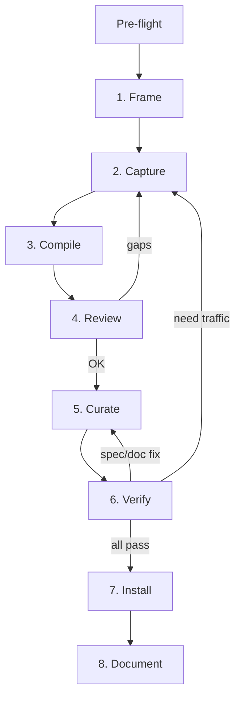

# Add or Expand a Site

Complete workflow for adding a new site package or expanding an existing one.



## Pre-flight Decisions

### Incremental Mode (Existing Site)

Read `DOC.md` + `openapi.yaml` from `src/sites/<site>/` or
`$OPENWEB_HOME/sites/<site>/`. Focus on auth, write endpoints, adapter needs.
Identify gaps, enter at **Step 2**. Use DOC.md **Workflows** for chain
dependencies. Do not hardcode IDs — execute a list op for fresh ones.

### Net-New Mode

Read these knowledge files in order. Each produces a concrete decision.

1. **`knowledge/archetypes/index.md`** — identify archetype, read profile.
   **Decision:** Target operations, expected auth/transport.

2. **`knowledge/bot-detection.md`** — check for site or vertical.
   **Decision:** Real Chrome profile needed? Short sessions?

3. **`knowledge/auth-routing.md`** — scan routing table.
   **Decision:** Log in before capture? (Chinese web: `cookie_session` +
   signing; Google: `sapisidhash`; Reddit-like SPAs: `exchange_chain`;
   public APIs: no auth). Log in first if auth expected — unauthenticated
   capture misses auth-required endpoints entirely.

   **Cannot be auto-detected** (preserve during merge):
   `page_global` (JS-embedded API keys), `webpack_module_walk` (webpack
   closure tokens).

### Adapter-Only Sites

When capture-compile produces 0 usable operations (all SSR/LD+JSON/DOM
or proprietary protocol): write adapter directly. See `add-site/capture.md`.

**Probing checklist before committing to adapter-only:**
1. Open DevTools Network/XHR — if zero JSON responses appear, it's SSR/DOM-only.
2. Check `view-source:` for `__NEXT_DATA__`, `__INITIAL_STATE__`, LD+JSON — these
   are extraction targets (use `x-openweb.extraction`), not adapter-only signals.
3. Try the on-page search box — some sites serve SSR for direct nav but use JSON
   APIs for in-app search/pagination.
4. Check if the mobile app calls a hidden public API the web version doesn't use.

## Critical Rules

### Browser First, No Direct HTTP

**NEVER use curl, fetch, wget, or direct HTTP to probe a site.** Bot
detection tracks IP reputation. A single non-browser request raises the risk
score, poisoning subsequent browser sessions.

### Write Operation Safety

| Level | Examples | Rule |
|-------|----------|------|
| SAFE | like, bookmark, follow, add-to-cart | Capture freely, reversible |
| CAUTION | send message (to self), post (then delete) | Only in safe contexts |
| NEVER | purchase, delete account, send to others | Do not trigger |

Verify skips write ops by default (`replaySafety: unsafe_mutation`).

---

## Step 1: Frame

Define 3-5 target intents as **user actions**, not API names.

Create or update `src/sites/<site>/DOC.md` with initial overview and
target-intent checklist. Read `add-site/document.md` for the template.

**Write intents** — add writes for core interactions (social: like/follow/
bookmark/repost; commerce: add-to-cart/wishlist). Perform ALL safe writes
during capture — missing one means missing that operation.

**Exit criteria:** Target intents defined. DOC.md has initial overview.
---

## Step 2: Capture

```bash
openweb capture start --isolate --url https://<site-domain>
# browse to trigger each target intent
openweb capture stop --session <session-id>
```

`--isolate` records only the dedicated tab's traffic. Output goes to
`$OPENWEB_HOME/captures/<session-id>/`.

Read `add-site/capture.md` for capture modes, auth injection, scripted
capture, and troubleshooting.

**Exit criteria:** `traffic.har` exists. All target intents exercised.

---

## Step 3: Compile

```bash
openweb compile <site-url> --capture-dir <capture-dir>
```

Runs: analyze -> auto-curate -> generate -> verify.

| Output | Location |
|--------|----------|
| `analysis-summary.json`, `analysis.json`, `verify-report.json`, `summary.txt` | `$OPENWEB_HOME/compile/<site>/` |
| `openapi.yaml`, `asyncapi.yaml`, `manifest.json`, `examples/` | `$OPENWEB_HOME/sites/<site>/` |

Auto-curation accepts all clusters, picks top auth candidate, uses
suggested camelCase operation names.

**Exit criteria:** Compile succeeds. Outputs exist at expected locations.

---

## Step 4: Review

Check `summary.txt`, then `verify-report.json`:

| `driftType` | Action |
|-------------|--------|
| `auth_drift` | Auth expired or no browser for cookies |
| `schema_drift` | Response shape changed |
| `endpoint_removed` | Wrong path, network error, or site down |
| `error` | Check `detail` (e.g., "no browser tab open") |

Read `add-site/review.md` for detailed analysis reading (start with `analysis-summary.json`).

**Adapter escalation** — write an adapter when: per-request headers change
every call (signing), same op returns different hashes (query rotation),
or op works in browser but 404s from `page.evaluate(fetch)`.

**SSR-heavy:** Many noise ops, zero data ops = SSR-delivered data. Write
an adapter. **GraphQL persisted queries:** Deployment-scoped hashes; on
"PersistedQueryNotFound", re-capture or adapter. See `knowledge/graphql.md`.

### Re-capture vs Continue

| Situation | Action |
|-----------|--------|
| Intents mapped to operations | Continue to Step 5 |
| Missing intents | Return to Step 2 |
| Auth contamination (off-domain cookies) | Re-capture with `--isolate` |
| Site blocked | Document in DOC.md, inform user |

**Exit criteria:** All target intents have operations. No adapter
escalation. Verify results understood.

---

## Step 5: Curate

Edit the generated spec and docs. Artifacts stay in
`$OPENWEB_HOME/sites/<site>/`.

1. **Merge** (if existing) — read `add-site/curate-operations.md`
2. **Operations** — `add-site/curate-operations.md` (noise, naming, params)
3. **Runtime** — `add-site/curate-runtime.md` (auth/CSRF, transport, extraction)
4. **Schemas** — `add-site/curate-schemas.md` (schemas, examples/PII)
5. **DOC.md** — if you can't write a clear workflow, revisit naming/grouping
6. **PROGRESS.md** — append entry

**Auth preservation:** Auth is site-level. Even if read ops pass without it,
removing auth/csrf from `servers[0].x-openweb` breaks all write ops.

**Exit criteria:** Spec follows conventions. Auth/transport configured.
DOC.md has clear workflows. PROGRESS.md updated.

---

## Step 6: Verify

**Must be performed by an independent agent** — not the agent that curated.

Read `add-site/verify.md` for the full process covering three dimensions:
- **Runtime** — do operations return data?
- **Spec** — does the spec follow curation standards?
- **Doc** — does DOC.md follow the template?

All three must pass. Spec/doc issues -> Step 5. Missing traffic -> Step 2.

**Exit criteria:** All three verify dimensions pass per `add-site/verify.md`.

---

## Step 7: Install

Copy the curated package to the source tree.

```bash
mkdir -p src/sites/<site>
cp -r $OPENWEB_HOME/sites/<site>/* src/sites/<site>/
pnpm build && pnpm test
```

Verify: `ls src/sites/<site>/openapi.yaml`, `openweb sites`, `openweb <site>`.

Three paths: `$OPENWEB_HOME/sites/` (compile cache),
`src/sites/` (source — edit here), `dist/sites/` (build).
Do not overwrite `adapters/`. Run `pnpm build` after source edits —
it syncs FROM `src/sites/` TO cache/dist, overwriting cache edits.

**Exit criteria:** Build and tests pass. Source-tree files confirmed.

---

## Step 8: Document

Read `add-site/document.md` for DOC.md template, PROGRESS.md format, and
knowledge update criteria.

- Finalize DOC.md with verified workflows and data-flow documentation.
- If you learned something that generalizes across sites, write to
  `knowledge/`.
- If you hit pipeline friction (not site-specific), write
  `src/sites/<site>/pipeline-gaps.md` — see `add-site/document.md` for format.

**Exit criteria:** DOC.md finalized. Knowledge updated if applicable.
Pipeline gaps documented if any.
