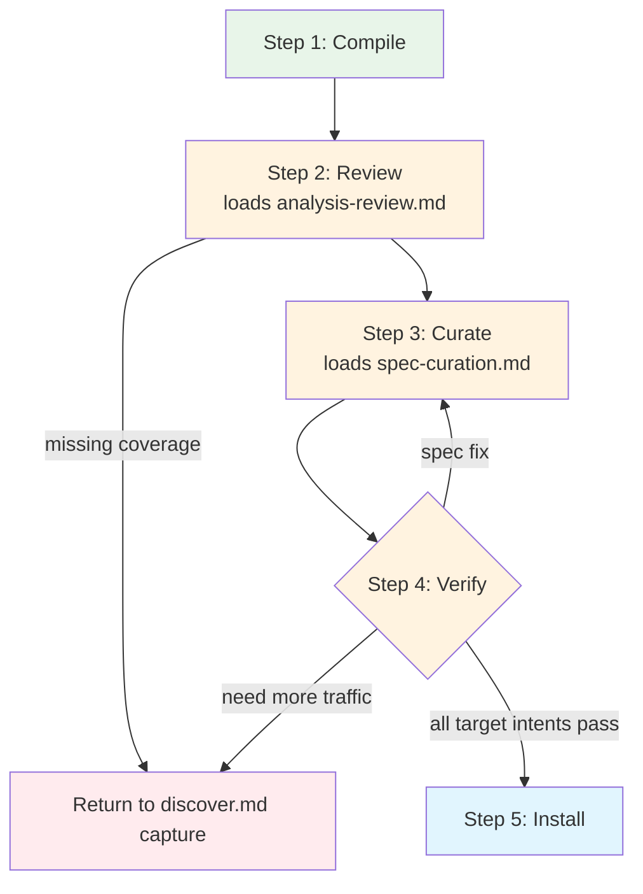

# Compile Process

How to turn captured traffic into a working site package: compile, review,
curate, verify, and install.

## When to Use

- After capturing traffic via `discover.md`
- Reviewing or editing an existing site package
- Recompiling an existing site with new traffic

## What Compile Already Does

When `openweb compile` runs, it executes the full pipeline in one shot:
1. **Analyze** — labeled traffic, clustered API requests, detected auth, found extraction signals
2. **Auto-curate** — accepted all clusters, picked top auth candidate, used suggested names
3. **Generate** — produced `openapi.yaml`, `asyncapi.yaml`, `manifest.json`, test fixtures
4. **Verify** — replayed safe operations via node HTTP, recorded pass/fail results

Your job is to review these outputs and fix what auto-curation got wrong.

**Important compile-time verify behavior:**
- Compile-time verify uses the same `verifySite()` as the lifecycle verifier —
  full executor with all transports, auth resolvers, and fingerprinting.
- Operations that require `page` transport will fail if no browser is running,
  with `driftType: error` and detail "no browser tab open" — this is expected.
- Auth is resolved automatically via the executor's auth chain: token cache →
  browser CDP → fail. If a browser is running (common after recording), auth
  cookies are available. Without a browser, auth-required ops report `auth_drift`.

## Process



**Exit criterion:** For each target intent, at least one operation returns
real data via `openweb <site> exec <op> '{...}'`.

### Step 1: Compile

```bash
openweb compile <site-url> --capture-dir <capture-dir>
```

This runs the FULL pipeline in one shot — analyze, auto-curate, generate,
and verify. It produces:

| Output | Location | Purpose |
|--------|----------|---------|
| `analysis.json` | `~/.openweb/compile/<site>/` | Analysis report (response bodies stripped) |
| `analysis-full.json` | `~/.openweb/compile/<site>/` | Full report (large, rarely needed) |
| `verify-report.json` | `~/.openweb/compile/<site>/` | Per-operation verification results |
| `summary.txt` | `~/.openweb/compile/<site>/` | One-line summary |
| `openapi.yaml` | `~/.openweb/sites/<site>/` | Generated HTTP spec |
| `asyncapi.yaml` | `~/.openweb/sites/<site>/` | Generated WS spec (if WS traffic) |
| `manifest.json` | `~/.openweb/sites/<site>/` | Package metadata |
| `examples/*.example.json` | `~/.openweb/sites/<site>/` | Example fixtures (PII-scrubbed) |

The auto-curation accepts all clusters, picks the top-ranked auth candidate,
and uses the analyzer's suggested operation names (camelCase by default, e.g.,
`listUsers`, `getProduct`).

### Step 2: Review

**Read `summary.txt` first** — one line showing operation count, verify pass
rate, auth status. Example: `8 HTTP ops, 5 verified, 42/120 API samples, auth=detected`

**Then read `verify-report.json`** — compile-time verify output using the
`SiteVerifyResult` format. Check each operation's `status`:
- `PASS` — the operation works. Good.
- `DRIFT` — the operation works but response shape changed from stored fingerprint.
- `FAIL` — needs investigation. Check `driftType` and `detail`.

**Note:** Operations with `replaySafety: unsafe_mutation` (write ops) are skipped
entirely — they do not appear in the verify report. This is controlled by the
`replay_safety` field in example files, falling back to `x-openweb.permission` or
HTTP method.

**Interpreting compile-time verify failures (`verify-report.json`):**

| `driftType` | What to check |
|-------------|---------------|
| `auth_drift` | Auth expired or no browser running for cookie resolution. If browser was running during compile, cookies may be expired. Otherwise, expected — auth ops fail without cookies. |
| `schema_drift` | Response shape changed from stored fingerprint. May indicate API change or dynamic content. |
| `endpoint_removed` | Request failed entirely — wrong path, network error, or site down. |
| `error` | Execution error. Check `detail` for specifics: "no browser tab open" means page transport needed without browser. Transient errors are also reported here. |

**Now read `references/analysis-review.md`.** It covers how to read
`analysis.json` in detail: auth candidates, clusters, extraction signals,
WebSocket analysis, and coverage decisions.

**Decide:**
- Coverage OK → continue to Step 3.
- Missing target intents → return to `discover.md` for more capture.
- Site blocked → document in DOC.md and tell the user.

### Step 3: Curate

**Read `references/spec-curation.md` now.** It is the complete guide for
editing the generated spec: removing noise, renaming operations, fixing auth
and transport, setting permissions, reviewing schemas, and handling write ops.

Apply the edits described there to `~/.openweb/sites/<site>/openapi.yaml`
(and `asyncapi.yaml` if WS operations are present).

### Step 4: Verify

After editing the spec, verify it works at runtime.

#### Batch Verify

```bash
openweb verify <site>
openweb verify <site> --browser   # also verify page-transport ops (auto-starts browser)
```

For sites that use `transport: page`, use `--browser` — it auto-starts the managed
browser if not already running and verifies page-transport ops that would otherwise fail.

`openweb verify <site>` reports lifecycle statuses:

| Status | What it means | What to do |
|--------|---------------|------------|
| `PASS` | Works. Continue to runtime exec. | |
| `DRIFT` | Works but response shape changed. | Re-compile or update fixtures if intentional. Document if transient. |
| `auth_expired` | Login/session expired. | `openweb login <site>`, `openweb browser restart`, rerun verify. |
| `FAIL` | Execution failed. | Read detail line. Fix spec or environment and rerun. |
| `FAIL` (403 with cookies) | Most ops return 403 even with valid cookies. | Wrong CSRF — check `authCandidates[0].csrfOptions` in analysis.json. See `analysis-review.md` CSRF Troubleshooting. |

#### Runtime Exec Exit Gate

Batch verify checks HTTP sanity. Runtime exec proves an agent can get usable data.

For each target intent, exec the best operation:

```bash
openweb <site> exec <operation> '{"param": "value"}'
```

**Exit criterion:** Each target intent has at least one operation that returns
real data — HTTP 2xx, valid JSON, non-empty response with expected fields.

If all pass → continue to Step 5 (install).
If any fail → diagnose below.

Common issues at this stage:
- `needs_browser` → run `openweb browser start`
- `needs_login` → log in to the site in the managed browser
- Hangs → check if token cache is stale (restart browser)
- Empty response → the API may need different parameters

#### Diagnose and Loop

When runtime exec fails, diagnose the root cause and fix the spec.
Do not re-capture unless the problem is missing traffic.

| Response | Likely cause | Fix |
|----------|-------------|-----|
| 403 | Wrong CSRF config, missing headers, expired session | Check CSRF cookie/header names. Check if CSRF scope excludes GET. Check for extra required headers. If cookies missing: `openweb login <site>` |
| 401 | Session expired | `openweb login <site>`, restart browser |
| 999 / bot block | Node transport hitting bot detection | Switch to `page` transport |
| 200 HTML (not JSON) | SSR page endpoint, not API | Remove op and use API equivalent, or add extraction config |
| 404 | Wrong path template | Fix path parameter normalization in spec |
| 400 | Bad param examples or missing required params | Update `exampleValue` fields in spec |
| 200 empty/wrong data | Wrong query variables or response schema | Check captured request params vs what you're sending |
| Timeout / hang | Stale token cache, browser not running | `openweb browser restart`, clear token cache |
| Redirect loop | Auth-gated endpoint, not logged in | Log in, or remove endpoint |

After fixing the spec, return to batch verify. If the fix requires more captured
traffic (missing endpoints, wrong API domain), return to `discover.md` Step 2
for re-capture.

> **When to stop iterating:**
> - After 2 fix-and-verify cycles with no progress, the issue is likely
>   missing traffic (return to `discover.md` Step 2) or a blocked site.
> - If bot detection blocks all transports and no workaround exists,
>   document the blocker in DOC.md Known Issues and tell the user.
> - If the only failing ops are non-target bonus operations, proceed to
>   install — document the failures in Known Issues.

#### WS Verification

If AsyncAPI operations are present:
- Can the WebSocket connect with the detected auth?
- Does the heartbeat interval match?
- Do subscribe operations receive expected event types?

### Step 5: Install

When all operations pass verification (or failures are understood and documented):

#### Copy or Merge into Source Tree

Copy the generated package from `~/.openweb/sites/<site>/` to `src/sites/<site>/`:

```bash
mkdir -p src/sites/<site>
cp ~/.openweb/sites/<site>/openapi.yaml src/sites/<site>/
cp ~/.openweb/sites/<site>/manifest.json src/sites/<site>/
# Copy asyncapi.yaml only if WS operations are present
# Copy examples/ directory
```

If the site already has a package, merge carefully — do not lose existing
adapter files, DOC.md, or PROGRESS.md.

#### Merging with an Existing Package

When the site already has a package at `src/sites/<site>/`:

1. **Read the existing package first.** Open `openapi.yaml` and note:
   - Write operations (permission: write) — these are manually authored
   - Adapter references (x-openweb.adapter) — these have custom code
   - Complex auth config (exchange_chain, page_global, sapisidhash, webpack_module_walk)
   - Custom $ref schemas in components/

2. **Copy new spec to a temp location.** Do not overwrite the existing spec.

3. **Merge operations:**
   - Add genuinely new operations (new paths not in existing spec) from
     the new spec into the existing spec.
   - For operations that exist in both: keep existing if it has better
     schemas, params, or was manually curated. Take new if existing was
     a stub.
   - NEVER delete existing write operations.
   - NEVER delete existing adapter references.

4. **Merge auth:** If existing has complex auth (exchange_chain, page_global,
   sapisidhash, webpack_module_walk), keep it. If existing has no auth and
   new detected cookie_session + CSRF, take the new auth config.

5. **Preserve adapters:** Copy no adapter files from the new package. The
   existing adapter directory is always authoritative.

6. **Update DOC.md:** Add new operations to the operations table. Do not
   remove existing operation documentation.

#### Write DOC.md

Create or update `src/sites/<site>/DOC.md` per `references/site-doc.md`.

Required sections: **Overview, Quick Start, Operations, Auth, Transport, Known Issues.**
See `references/site-doc.md` for the canonical template.

#### Write PROGRESS.md

Append the first entry (or a new entry) to `src/sites/<site>/PROGRESS.md`:
```markdown
## YYYY-MM-DD: Initial compile (or: Added N operations)

**What changed:**
- Compiled N HTTP operations, M WS operations
- Auth: <type>, Transport: <type>

**Why:**
- <user request or coverage goal>

**Verification:** N/M passed
**Commit:** <short hash>
```

#### Build and Test

```bash
pnpm build && pnpm test
```

Verify the source-tree copy (not just the CLI cache):
```bash
ls src/sites/<site>/openapi.yaml     # confirm spec file exists in repo
openweb sites                        # confirm CLI recognizes the site
openweb <site>                       # confirm operations are listed
```

**Note:** `openweb sites` resolves from `~/.openweb/sites/` first (the compile
cache), so it can succeed even if the `src/sites/` copy is missing. Always
verify the repo files directly.

#### Sync CLI Cache

After installing to the source tree and running `pnpm build`, the CLI cache
at `~/.openweb/sites/` may still hold the pre-edit version. Three paths exist:
- `~/.openweb/sites/<site>/` — compile cache (what `openweb` reads at runtime)
- `src/sites/<site>/` — developer source tree (what you edit and commit)
- `dist/sites/<site>/` — build output

If you edited `src/sites/<site>/openapi.yaml` after compile, the compile cache
is stale. Run `pnpm build` to update the build output, then verify against
the source tree — not the cache.

#### Update Knowledge (if applicable)

If you learned something new during compile that generalizes across sites,
write it to `references/knowledge/` per `references/update-knowledge.md`.

## Appendix: Pipeline Improvement Report

If you hit friction during the compile process that wasn't site-specific — a
rule too tight, a heuristic too loose, a doc gap that wasted a cycle — write it up.

Create `src/sites/<site>/pipeline-gaps.md`. The goal is NOT to overfit to this
site, but to surface systematic issues that make ALL site discoveries less
efficient.

| Category | What to write |
|----------|--------------|
| **Doc gaps** | Missing guidance in discover.md or compile.md that caused you to waste a cycle. What should the doc have told you? |
| **Code gaps** | Pipeline heuristics that produced wrong results (e.g., CSRF auto-detection picked wrong cookie, transport always defaults to node). Include file:line references. |
| **Rules too tight** | Filters or gates that rejected valid data (e.g., httpOnly cookies excluded from CSRF candidates, off-domain APIs silently dropped). |
| **Rules too loose** | Heuristics that let noise through (e.g., tracking cookies scored as auth, client hint headers matched as CSRF). |
| **Missing automation** | Manual steps that should be automated (e.g., no bot-detection signal → transport recommendation, no target-intent filtering during auto-curation). |

**Format:** For each issue, write: **Problem** (what happened), **Root cause**
(file:line if code), **Suggested fix** (what would help all sites, not just this one).
Only upstream improvements — skip site-specific workarounds already resolved in Step 4.

## Related References

- `references/discover.md` — capture workflow, framing intents
- `references/analysis-review.md` — how to read `analysis.json` (loaded at Step 2)
- `references/spec-curation.md` — how to clean and configure specs (loaded at Step 3)
- `references/site-doc.md` — DOC.md / PROGRESS.md template
- `references/update-knowledge.md` — when to write cross-site patterns
- `references/knowledge/archetypes/index.md` — per-archetype curation expectations
- `references/knowledge/auth-patterns.md` — auth primitive structures
- `references/knowledge/graphql-patterns.md` — GraphQL sub-clustering
- `references/knowledge/extraction-patterns.md` — SSR/DOM extraction
- `references/knowledge/ws-patterns.md` — WS patterns
- `references/knowledge/troubleshooting-patterns.md` — failure diagnosis
