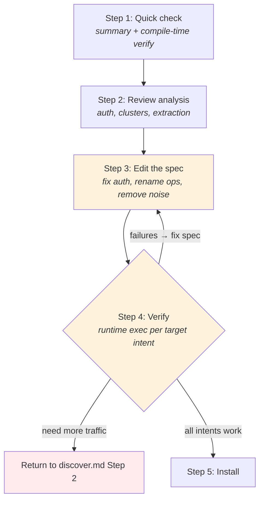

# Compile Reference

How to review, curate, and troubleshoot a compiled site package.

Self-contained — use during `discover.md` Step 5, or standalone when
reviewing an existing site package.

## When to Use

- During discovery Step 5 — compile, curate, verify, diagnose loop
- Standalone — reviewing or editing an existing site package
- Recompiling an existing site with new traffic

## What Compile Already Did

When you arrive here, `openweb compile` has already run the full pipeline:
1. **Analyze** -- labeled traffic, clustered API requests, detected auth, found extraction signals
2. **Auto-curate** -- accepted all clusters, picked top auth candidate, used suggested names
3. **Generate** -- produced `openapi.yaml`, `asyncapi.yaml`, `manifest.json`, test fixtures
4. **Verify** -- replayed safe operations via node HTTP, recorded pass/fail results

Your job is to review these outputs and fix what auto-curation got wrong.

**Important compile-time verify behavior:**
- Compile-time verify uses the same `verifySite()` as the lifecycle verifier —
  full executor with all transports, auth resolvers, and fingerprinting.
- Operations that require `page` transport will fail if no browser is running,
  with `driftType: error` and detail "no browser tab open" — this is expected.
- Auth is resolved automatically via the executor's auth chain: token cache →
  browser CDP → fail. If a browser is running (common after recording), auth
  cookies are available. Without a browser, auth-required ops report `auth_drift`.

## Artifacts to Review

| Artifact | Location | What to check |
|----------|----------|---------------|
| `summary.txt` | `~/.openweb/compile/<site>/` | Quick overview -- read this first |
| `analysis.json` | `~/.openweb/compile/<site>/` | Analysis report (see reading guide below) |
| `verify-report.json` | `~/.openweb/compile/<site>/` | Per-operation pass/fail with diagnostics |
| `openapi.yaml` | `~/.openweb/sites/<site>/` | Generated HTTP spec -- this is what you edit |
| `asyncapi.yaml` | `~/.openweb/sites/<site>/` | Generated WS spec (if WS traffic) |
| `manifest.json` | `~/.openweb/sites/<site>/` | Package metadata |

## Process



**Exit criterion:** For each target intent, at least one operation returns
real data via `openweb <site> exec <op> '{...}'`.

### Step 1: Quick Check (summary + compile-time verify)

**Read `summary.txt` first** -- one line showing operation count, verify pass rate, auth status.
Example: `8 HTTP ops, 5 verified, 42/120 API samples, auth=detected`

**Then read `verify-report.json`** -- this is the compile-time verify output
produced during `openweb compile`. It now uses the same `SiteVerifyResult` format
as `openweb verify <site>`. Check each operation's `status`:
- `PASS` -- the operation works. Good.
- `DRIFT` -- the operation works but response shape changed from stored fingerprint.
- `FAIL` -- needs investigation. Check `driftType` and `detail`.

**Note:** Operations with `replaySafety: unsafe_mutation` (write ops) are skipped
entirely — they do not appear in the verify report. This is controlled by the
`replay_safety` field in example files, falling back to `x-openweb.permission` or
HTTP method.

**Interpreting compile-time verify failures (`verify-report.json`):**

| `driftType` | What to check |
|-------------|---------------|
| `auth_drift` | Auth expired or no browser running for cookie resolution. If browser was running during compile, cookies may be expired. Otherwise, expected — auth ops fail without cookies. |
| `schema_drift` | Response shape changed from stored fingerprint. May indicate API change or dynamic content. |
| `endpoint_removed` | Request failed entirely — wrong path, network error, or site down. |
| `error` | Execution error. Check `detail` for specifics: "no browser tab open" means page transport needed without browser. Transient errors are also reported here. |

### Step 2: Review Analysis Report

**DO NOT read the full `analysis.json`.** Read specific sections only.
Skip the `samples` array entirely -- it contains every labeled request and is huge.
Skip the `navigation` array -- it groups requests by page and is only useful for
debugging missing traffic.

#### 2a. Auth Candidates

> Before reading: scan `references/knowledge/auth-patterns.md` "Routing Table"
> to know what auth type to expect for this site's archetype.
> Chinese sites: expect `cookie_session`, possibly with custom signing.
> Google properties: expect `sapisidhash`.
> Public APIs: expect no auth (confidence 0).
> SPA with login: expect `localStorage_jwt` or `exchange_chain`.

Search for `"authCandidates"` in `analysis.json`. Read that array. Check the
top candidate (rank 1):

- **`auth.type`** -- does it match your expectation from the knowledge file?
- **`confidence`** -- above 0.7 is reliable. Below 0.5 is suspect.
- **`evidence.matchedCookies`** -- are these real auth cookies or tracking cookies?
  Known tracking cookies (`__cf_bm`, `_ga`, `__gads`, `datadome`) should NOT
  appear. If they do, the detection has a false positive -- the tracking cookie
  denylist may need updating.
- **`csrf`** -- is CSRF detected? Social sites with write ops usually need it.
  Check `csrf.type` (`cookie_to_header` or `meta_tag`) and the cookie/header names.
- **`evidence.notes`** -- human-readable explanation of why this auth was detected.
  Read this for quick validation.

**If auth looks wrong:** You will edit the generated `openapi.yaml`'s
`servers[0].x-openweb` section manually in Step 3. Note what needs changing now.

#### CSRF Troubleshooting

The auto-detected CSRF may be wrong. Check `authCandidates[0].csrfOptions` in analysis.json --
it lists ALL cookie-to-header matches ranked by confidence.

Common false positives:
- Locale cookies (e.g., `lc-main=en_US` -> `x-li-lang: en_US`) -- short values, not tokens
- Preference cookies -- browser settings forwarded as headers

How to identify the real CSRF:
- Look for headers named `csrf-token`, `x-csrf-token`, `x-csrftoken`
- Look for cookies named `JSESSIONID`, `csrftoken`, `_csrf`
- Real CSRF tokens are long random strings (>10 chars), not short words

To override: create a curation file and re-compile:
```bash
echo '{"csrfType": "cookie_to_header"}' > curation.json
openweb compile <site-url> --capture-dir <dir> --curation curation.json
```

If re-compiling is not needed, manually edit the generated spec's `csrf` section
in `openapi.yaml` directly (see Step 3c).

#### 2b. Clusters

> For GraphQL sites: read `references/knowledge/graphql-patterns.md` first --
> check the "Persisted Queries" and "Batched Queries" sections to know what
> patterns to look for in the clusters.

Search for `"clusters"` in `analysis.json`. Read that array. For each cluster:

- **`suggestedOperationId`** -- auto-generated names are camelCase heuristics
  based on HTTP method and path (e.g., `listUsers`, `getProduct`, `search`).
  These often need renaming to be meaningful (e.g., `getXGraphQl` should
  become `searchTweets`).
- **`suggestedSummary`** -- derived from the operationId. Usually needs rewriting
  to describe the user action.
- **`method` + `pathTemplate`** -- does the path look correctly normalized?
  - `/users/123` and `/users/456` should normalize to `/users/{id}`
  - If different paths got incorrectly merged, `normalization.originalPaths`
    shows what was collapsed.
- **`graphql`** -- present on GraphQL sub-clusters. Check:
  - `operationName` -- does each GraphQL query get its own cluster?
  - `discriminator` -- how were sub-clusters split? (`operationName`, `queryId`,
    `persistedQueryHash`, or `queryShape`)
  - If all GraphQL requests collapsed into one cluster (no `graphql` field,
    high `sampleCount`), sub-clustering failed. Note this -- you will need to
    manually identify the distinct operations in Step 3.
- **`sampleCount`** -- very high counts (100+) on a single path suggest:
  - GraphQL collapse (see above)
  - A polling endpoint (check if it is a real user-facing operation)
  - Analytics/tracking that was not filtered (should be excluded)
- **`parameters`** -- auto-inferred parameters with types and example values.
  Check that required params are marked required and examples are sensible.
- **`responseVariants`** -- status codes and content types observed. Multiple
  variants (e.g., 200 JSON + 401 JSON) are normal.

Note which clusters to exclude and which operation names to change -- you will
apply these edits to the generated spec in Step 3.

**Noise clusters to look for:** See Step 3a noise exclusion criteria. Note
clusters that match — you will delete them in Step 3.

#### 2c. Extraction Signals

> Read `references/knowledge/extraction-patterns.md` -- check the "Decision Flow"
> to understand when extraction is preferred over API replay.

Search for `"extractionSignals"` in `analysis.json`. The array contains:
- `type: "ssr_next_data"` -- Next.js `__NEXT_DATA__` found in HTML.
  `estimatedSize` tells you if there is real data or just a skeleton.
- `type: "script_json"` -- `<script type="application/json">` blocks found.
  `selector` and `id` help you locate the exact element.

**Note:** The analyzer only auto-detects these two patterns. Other extraction types
require manual inspection in the browser:
- `page_global` (e.g., `window.__INITIAL_STATE__`) -- check page source
- `__NUXT__` -- check for `window.__NUXT__` or `window.__NUXT_DATA__` in page source
- `html_selector` -- when data is only in DOM elements, no JSON at all

If API clusters are weak (few samples, noisy responses) but the page has rich SSR
data, extraction may be the better approach. Note this for Step 3.

#### 2d. WebSocket Connections (if present)

> Read `references/knowledge/ws-patterns.md` -- check "Curation Signals" to
> distinguish operations from noise.

Search for `"ws"` at the top level of `analysis.json`:
- `connections[].url` -- is this a real data channel or just telemetry?
- `connections[].executableOperationCount` -- are there meaningful WS operations?
- `connections[].heartbeatCandidates` -- heartbeat interval and payload detected?
- `connections[].operations[]` -- what patterns were found (`subscribe`, `stream`,
  `request_reply`, `publish`)?

Heartbeat-only connections and presence/typing-indicator channels are noise -- exclude them.

### Step 3: Review and Edit the Generated Spec

The generated spec is at `~/.openweb/sites/<site>/openapi.yaml`.
Read it. This is the spec that becomes the site package.

#### 3a. Remove Noise Operations

Delete operations for clusters you identified as noise in Step 2b.

**Noise exclusion criteria — delete any operation matching these:**
- Analytics/tracking endpoints
- CDN/static asset endpoints (`/static/`, `/_next/`, `/assets/`)
- Polling/heartbeat-only endpoints
- 4xx-only clusters (no successful responses)
- Paths or names containing: `collector`, `log`, `batch`, `telemetry`, `apm`,
  `tracking`, `beacon`, `zlab`, `commercial`, `impression`, `feedback`, `popup`
- POST endpoints that return empty or 204 responses (likely logging/telemetry)
- Operations where the operationId is just `get` or `create` with no noun
  (path normalization artifact — meaningless)
- Internal framework endpoints: `rsc-action`, `flagship-web`, `_next`

**Write op quality bar — not every POST is a write op.** Real write ops are
user-facing actions a user would knowingly trigger:
- Like/upvote, follow/unfollow, bookmark/save, post/comment, vote, repost
- NOT: `createCollectorApm`, `createZaLogsBatch`, `createCommercialEcommerce`
- Test: "would a user knowingly trigger this action?" If no, it is
  infrastructure noise — exclude it.

**Recovering write ops from auto-curated names:** The compiler generates names
like `createAnswersVoters` (upvote), `createMembersFollowers` (follow),
`createStatusesSetlike` (like). These look like noise but are real write ops.
Before deleting any POST operation, cross-reference against your write intents
from Step 1. Check the URL path:
- `/answers/{id}/voters` or `/like` → upvote/like
- `/members/{id}/followers` or `/friendships/create` → follow
- `/{resource}/{id}/favorites` → bookmark/save

After removing noise, review ALL remaining non-target operations. Keep an
operation only if it meets ALL of:
- Returns structured JSON (not HTML, not empty)
- Is on the primary domain (not off-domain CDN/analytics)
- Has clear user value (e.g., `getMe`, `getHotSearch`, `getRecommendFeed`)
- Can be given a meaningful name — if you cannot name it, it is probably noise

**Same quality bar for all kept ops.** Non-target operations have lower PRIORITY
than target ops, but the same STANDARD. Every kept operation must have:
- A meaningful, descriptive `operationId` (not URL-derived gibberish like
  `getXWebInterfaceWbiViewDetail`)
- A useful `summary` describing the user action
- Noise excluded — no telemetry, logging, or framework internals

If an auto-curated name is not meaningful and you cannot determine what the
operation does, it is noise — exclude it.

#### Anti-bot / Fingerprint Parameters

After removing noise operations, clean anti-bot parameters from the operations
you keep. These are browser-generated tokens that the adapter or page transport
handles automatically — they do not belong in the operation's parameter list.

Common anti-bot parameters to **remove**:
- `dm_cover_img_str`, `dm_img_inter`, `dm_img_list`, `dm_img_str` (Bilibili anti-bot)
- `w_rid`, `wts` (Bilibili wbi signature — generated by browser JS)
- `x-bogus`, `_signature`, `msToken` (TikTok/Douyin anti-bot)
- `__a`, `__d`, `__s`, `__req`, `__rev` (Meta/Instagram/Facebook anti-bot)
- Any param whose example value is `<REDACTED_TOKEN>` or fragmented JSON

Rule of thumb: if a param's purpose is not clear from its name and its example
value is random or opaque, it is anti-bot infrastructure. Remove it.

#### 3b. Rename Operations

Replace auto-generated `operationId` values with clear, descriptive names.
Auto-generated names use camelCase convention (e.g., `listUsers`, `getProduct`)
but still need semantic review:

- `getApiV1SearchResults` -> `searchProducts`
- `listGraphql` -> `searchUsers` (for GraphQL, name by the operation, not the endpoint)
- `getUsersUser` -> `getUserProfile`

Update `summary` to describe the user action, not the URL:
- "Get api v1 search results" -> "Search products by keyword"

**Write meaningful summaries.** The summary should tell an agent what data the
operation returns, not just restate the operation name. Include 3-5 key response
fields so an agent can decide whether this operation has what it needs.

- Bad: "Get video detail info" (says nothing about what comes back)
- Good: "Get video detail — title, description, play count, likes, coins, favorites, danmaku count, uploader info"
- Bad: "Search content" (what content? what fields?)
- Good: "Search questions and answers by keyword, returns title, excerpt, vote count, author"

**Convention:** Use camelCase for operationId (`searchProducts`, `getUserProfile`).

#### Parameter Descriptions

Review parameter descriptions for user-facing clarity:
- Generic names need context: `id` -> "Subreddit name (without r/ prefix)"
- queryId should note the GraphQL operation name it references
- Opaque IDs should explain what they reference: "Post ID (base-36, e.g. '1jqk8w')"
- Include constraints: "Number of results (max 100)"
- Auto-generated descriptions from `annotate.ts` cover only common names
  (q, page, limit). All site-specific parameters need manual descriptions.

#### 3c. Fix Auth Configuration

If Step 2a found auth issues, edit the `servers[0].x-openweb` section:
```yaml
servers:
  - url: https://api.example.com
    x-openweb:
      transport: node          # or page
      auth:
        type: cookie_session   # or exchange_chain, localStorage_jwt, etc.
      csrf:
        type: cookie_to_header
        cookie: ct0
        header: x-csrf-token
```

Refer to `references/knowledge/auth-patterns.md` for the exact structure
of each auth primitive type.

#### 3d. Set Permissions

For each operation, check `x-openweb.permission`:
- GET/HEAD → `permission: read`
- GraphQL queries (even via POST) → `permission: read`
- POST/PUT/PATCH (mutations) → `permission: write`
- DELETE → `permission: delete`
- GraphQL mutations → `permission: write`

The compiler sets `replaySafety` per operation (`safe_read` or `unsafe_mutation`)
and writes it to `examples/*.example.json` as `replay_safety`. This controls
verify behavior — write ops are skipped during verify by default. Use
`openweb verify <site> --write` to include write/delete ops during QA
(transact ops are always excluded).

Auto-curation defaults are usually correct, but verify that GraphQL queries using
POST method have `permission: read`, not `permission: write`. The auto-curation
already handles this (checks `graphql.operationType === 'query'`), but double-check.

#### 3e. Review Response Schemas

Check the 200 response schemas in openapi.yaml. The compiler infers schemas from
captured responses, but hand-crafted or under-sampled specs may have bare schemas.

**Bare schemas to fix:** `type: object` with no `properties` for responses that
return non-empty JSON. This means the schema carries no information — agents can't
know what fields the response contains.

**How to enrich:**
1. For each read op with a bare `type: object` response, exec it:
   `openweb <site> exec <op> '{"param":"value"}'`
2. From the actual JSON response, infer a schema (properties, types, nested objects)
3. Replace the bare schema in openapi.yaml

**Keep schemas concise** — max 2-3 levels deep. Use `type: object` for deeply nested
sub-objects. For arrays, describe the item schema. Mark nullable fields.

**Acceptable bare schemas:** operations that return truly opaque objects (e.g., raw
API proxy responses) or empty 204 responses.

#### 3f. Review Examples for PII

Check parameter examples in the spec and example fixtures (`examples/*.example.json`):
- Real usernames, emails, phone numbers, addresses? Replace with generic values.
- Auth tokens or session IDs in examples? Remove.
- The scrubber catches common patterns, but flag anything it might miss.

#### 3g. Extraction Complexity Rule

If an operation uses SSR extraction and the `expression` exceeds ~5 lines,
extract it into an adapter file:

```
src/sites/<site>/
  openapi.yaml          <- references adapter, no inline JS
  adapters/<site>.ts    <- complex DOM parsing logic lives here
```

In openapi.yaml:
```yaml
x-openweb:
  adapter: ./adapters/<site>.ts
```

**Inline is OK for:** simple `ssr_next_data`, `page_global`, short `html_selector` (1-3 lines).
**Adapter is required for:** multi-line DOM queries, regex parsing, complex data transformation.

#### 3h. Curate Write Operations

Write operations require extra attention beyond read ops:

1. **Naming:** Use verb form matching the user action: `likePost`, `followUser`,
   `addToCart` — not URL-derived names.
2. **Permission:** Set `x-openweb.permission` to `write` (or `delete`/`transact` for
   destructive actions). See discover.md's Write Operation Safety table for levels.
3. **Replay safety:** The compiler sets `replaySafety: unsafe_mutation` internally,
   which causes `openweb verify` to skip write ops by default.
4. **Safety level:** Document the safety level (SAFE/CAUTION/NEVER) in DOC.md's
   operations table.
5. **Verify:** Use `openweb verify <site> --write` to include write/delete ops
   during QA (transact ops are always excluded). Alternatively, test manually:
   `openweb <site> exec <op> '{...}'` in a safe context (e.g., like a post you
   own, then unlike it).

### Step 4: Verify

After editing the spec, verify it works at runtime. Two levels: batch verify
(sanity check) and runtime exec (the real exit gate).

#### 4a. Batch verify

```bash
openweb verify <site>
openweb verify <site> --browser   # also verify page-transport ops (auto-starts browser)
```

This runs the lifecycle verifier against the installed site package.

For sites that use `transport: page`, use `--browser` — it auto-starts the managed
browser if not already running and verifies page-transport ops that would otherwise fail.

`openweb verify <site>` reports lifecycle statuses:
- `PASS` -- operation/site verified successfully
- `DRIFT` -- the site still works, but the response shape changed
- `FAIL` -- execution failed
- `auth_expired` -- auth-only failures (login/session issue)

| Status | What it means | What to do |
|--------|----------------|------------|
| `PASS` | Works. Continue to runtime exec. | |
| `DRIFT` | Works but response shape changed. | Re-compile or update fixtures if intentional. Document if transient. |
| `auth_expired` | Login/session expired. | `openweb login <site>`, `openweb browser restart`, rerun verify. |
| `FAIL` | Execution failed. | Read detail line. Fix spec or environment and rerun. |
| `FAIL` (403 with cookies) | Most ops return 403 even with valid cookies. | Wrong CSRF -- check `authCandidates[0].csrfOptions` in analysis.json. See CSRF Troubleshooting in Step 2a. |

#### 4b. Runtime exec — the exit gate

Batch verify checks HTTP sanity. Runtime exec proves an agent can get usable data.

For each target intent, exec the best operation:

```bash
openweb <site> exec <operation> '{"param": "value"}'
```

**Exit criterion:** Each target intent has at least one operation that returns
real data — HTTP 2xx, valid JSON, non-empty response with expected fields.

If all pass → continue to Step 5 (install).
If any fail → diagnose below.

Common issues at this stage:
- `needs_browser` → run `openweb browser start`
- `needs_login` → log in to the site in the managed browser
- Hangs → check if token cache is stale (restart browser)
- Empty response → the API may need different parameters

#### 4c. Diagnose + fix

When runtime exec fails, diagnose the root cause and fix the spec.
Do not re-capture unless the problem is missing traffic.

| Response | Likely cause | Fix |
|----------|-------------|-----|
| 403 | Wrong CSRF config, missing headers, expired session | Check CSRF cookie/header names. Check if CSRF scope excludes GET. Check for extra required headers. If cookies missing: `openweb login <site>` |
| 401 | Session expired | `openweb login <site>`, restart browser |
| 999 / bot block | Node transport hitting bot detection | Switch to `page` transport |
| 200 HTML (not JSON) | SSR page endpoint, not API | Remove op and use API equivalent, or add extraction config |
| 404 | Wrong path template | Fix path parameter normalization in spec |
| 400 | Bad param examples or missing required params | Update `exampleValue` fields in spec |
| 200 empty/wrong data | Wrong query variables or response schema | Check captured request params vs what you're sending |
| Timeout / hang | Stale token cache, browser not running | `openweb browser restart`, clear token cache |
| Redirect loop | Auth-gated endpoint, not logged in | Log in, or remove endpoint |

After fixing the spec, return to Step 4a. If the fix requires more captured
traffic (missing endpoints, wrong API domain), return to `discover.md` Step 2
for re-capture.

> **When to stop iterating:**
> - After 2 fix-and-verify cycles with no progress, the issue is likely
>   missing traffic (return to discover.md Step 2) or a blocked site.
> - If bot detection blocks all transports and no workaround exists,
>   document the blocker in DOC.md Known Issues and tell the user.
> - If the only failing ops are non-target bonus operations, proceed to
>   install — document the failures in Known Issues.

#### 4d. WS Verification

If AsyncAPI operations are present:
- Can the WebSocket connect with the detected auth?
- Does the heartbeat interval match?
- Do subscribe operations receive expected event types?

### Step 5: Install the Site Package

When all operations pass verification (or failures are understood and documented):

#### 5a. Copy to source tree

Copy the generated package from `~/.openweb/sites/<site>/` to `src/sites/<site>/`:

```bash
mkdir -p src/sites/<site>
cp ~/.openweb/sites/<site>/openapi.yaml src/sites/<site>/
cp ~/.openweb/sites/<site>/manifest.json src/sites/<site>/
# Copy asyncapi.yaml only if WS operations are present
# Copy examples/ directory
```

If the site already has a package, merge carefully -- do not lose existing
adapter files, DOC.md, or PROGRESS.md.

#### Merging with an Existing Package

When the site already has a package at `src/sites/<site>/`:

1. **Read the existing package first.** Open `openapi.yaml` and note:
   - Write operations (permission: write) -- these are manually authored
   - Adapter references (x-openweb.adapter) -- these have custom code
   - Complex auth config (exchange_chain, page_global, sapisidhash, webpack_module_walk)
   - Custom $ref schemas in components/

2. **Copy new spec to a temp location.** Do not overwrite the existing spec.

3. **Merge operations:**
   - Add genuinely new operations (new paths not in existing spec) from
     the new spec into the existing spec.
   - For operations that exist in both: keep existing if it has better
     schemas, params, or was manually curated. Take new if existing was
     a stub.
   - NEVER delete existing write operations.
   - NEVER delete existing adapter references.

4. **Merge auth:** If existing has complex auth (exchange_chain, page_global,
   sapisidhash, webpack_module_walk), keep it. If existing has no auth and
   new detected cookie_session + CSRF, take the new auth config.

5. **Preserve adapters:** Copy no adapter files from the new package. The
   existing adapter directory is always authoritative.

6. **Update DOC.md:** Add new operations to the operations table. Do not
   remove existing operation documentation.

#### 5b. Write DOC.md

Create or update `src/sites/<site>/DOC.md` per `references/site-doc.md`.

Required sections: **Overview, Quick Start, Operations, Auth, Transport, Known Issues.**
See `references/site-doc.md` for the canonical template.

#### 5c. Write PROGRESS.md

Append the first entry (or a new entry) to `src/sites/<site>/PROGRESS.md`:
```markdown
## YYYY-MM-DD: Initial compile (or: Added N operations)

**What changed:**
- Compiled N HTTP operations, M WS operations
- Auth: <type>, Transport: <type>

**Why:**
- <user request or coverage goal>

**Verification:** N/M passed
**Commit:** <short hash>
```

#### 5d. Build and test

```bash
pnpm build && pnpm test
```

Verify the source-tree copy (not just the CLI cache):
```bash
ls src/sites/<site>/openapi.yaml     # confirm spec file exists in repo
openweb sites                        # confirm CLI recognizes the site
openweb <site>                       # confirm operations are listed
```

**Note:** `openweb sites` resolves from `~/.openweb/sites/` first (the compile
cache), so it can succeed even if the `src/sites/` copy is missing. Always
verify the repo files directly.

#### 5e. Update knowledge (if applicable)

If you learned something new during compile that generalizes across sites,
write it to `references/knowledge/` per `references/update-knowledge.md`.

## Execution Model Decision

When reviewing the generated spec, decide on the transport for each operation.

### Transport Selection

```
Can node make the request without cookies?
  |-- Yes -> node transport (fastest)
  |-- No -> Does the site use bot detection (Akamai/PX/DataDome)?
       |-- No/light (basic Cloudflare) -> node + browser cookie extraction
       |-- Heavy -> page transport
            |-- Does page need specific JS context (signing, encryption)?
                 |-- No -> page with evaluate
                 |-- Yes -> adapter transport
```

> Read `references/knowledge/bot-detection-patterns.md` "Impact on Transport Selection"
> for the detailed decision tree.

### Does data come from WebSocket?

Yes -> curate WS operations in `asyncapi.yaml` alongside HTTP operations.
Review each protocol independently. A site package is ready only when all
useful protocols are curated.

## Common False Positives

- **Tracking cookies as auth**: Cloudflare, GA, Meta pixel cookies trigger
  `cookie_session` detection. Check `authCandidates[].evidence.matchedCookies`
  for tracking cookie names (`__cf_bm`, `_ga`, `__gads`). If you see these,
  the auth candidate is a false positive. Check if a lower-ranked candidate
  is better, or if the site is actually public (no auth needed).
- **Analytics as operations**: `/collect`, `/beacon`, `/pixel`, telemetry, logging
  POSTs -- see full noise exclusion list in Step 3a.
- **Dashboard noise**: SaaS dashboards generate heavy internal namespace traffic.
  Manual curation must filter these.
- **Heartbeat-only WS**: WebSocket connections with only ping/pong -- not operations.
- **4xx responses as operations**: 401/403/404 clusters appear because the
  analyzer does not filter by status. These clusters indicate auth-required
  endpoints or stale URLs -- cross-reference with `authCandidates`.

## Common False Negatives

- **Auth not detected**: User was not logged in, or unsupported auth pattern.
  Check `authCandidates` -- if the only candidate has `confidence: 0` and the
  `evidence.rejectedSignals` says "No cookie session overlap found", the user
  was probably not logged in during capture. Re-capture with login.
- **CSRF not detected**: Token embedded in JavaScript (not cookie/meta tag).
  Identify manually in browser dev tools and add to spec.
- **Operations missing**: Key pages not visited during capture. Return to
  `discover.md` for targeted browsing.
- **Cross-domain API**: Site calls a different domain. Check `summary.byCategory.off_domain`.
  Re-compile with the API domain or use a multi-server spec.
- **GraphQL collision**: Multiple operations collapsed into one cluster.
  Need capture with more varied queries. Check for missing `graphql` sub-cluster metadata.

## Anti-pattern: Probing with curl/fetch

**NEVER** test with curl/wget/fetch — poisons IP reputation. See discover.md
"Browser First" rule. Use `openweb verify <site>` instead.

## Related References

- `references/discover.md` -- coverage responsibility, capture workflow
- `references/site-doc.md` -- DOC.md / PROGRESS.md template
- `references/update-knowledge.md` -- when to write cross-site patterns
- `references/knowledge/archetypes/index.md` -- per-archetype curation expectations
- `references/knowledge/auth-patterns.md` -- auth primitive structures
- `references/knowledge/graphql-patterns.md` -- GraphQL sub-clustering and curation
- `references/knowledge/extraction-patterns.md` -- SSR/DOM extraction techniques
- `references/knowledge/ws-patterns.md` -- WS connection/message patterns
- `references/knowledge/troubleshooting-patterns.md` -- failure diagnosis patterns
