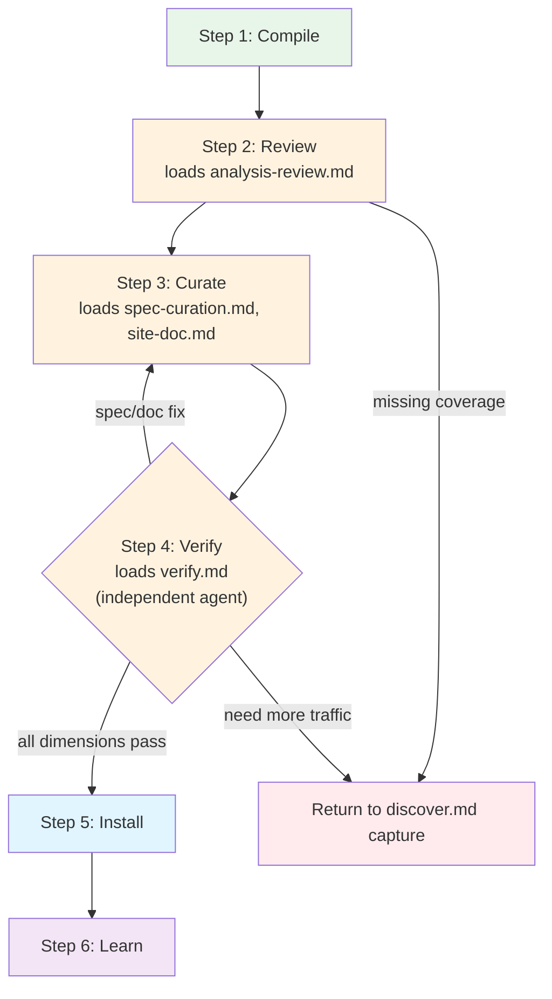

# Compile Process

How to turn captured traffic into a working site package: compile, review,
curate, verify, and install.

## When to Use

- After capturing traffic via `discover.md`
- Reviewing or editing an existing site package
- Recompiling an existing site with new traffic

## Process



**Exit criterion:** For each target intent, at least one operation returns
real data via `openweb <site> exec <op> '{...}'`.

### Step 1: Compile

```bash
openweb compile <site-url> --capture-dir <capture-dir>
```

This runs the full pipeline in one shot:
1. **Analyze** — label traffic, cluster API requests, detect auth, find extraction signals
2. **Auto-curate** — accept all clusters, pick top auth candidate, use suggested names
3. **Generate** — produce `openapi.yaml`, `asyncapi.yaml`, `manifest.json`, test fixtures
4. **Verify** — replay safe operations via node HTTP, record pass/fail results

Your job is to review these outputs and fix what auto-curation got wrong.

It produces:

| Output | Location | Purpose |
|--------|----------|---------|
| `analysis.json` | `$OPENWEB_HOME/compile/<site>/` | Analysis report (response bodies stripped) |
| `analysis-full.json` | `$OPENWEB_HOME/compile/<site>/` | Full report (large, rarely needed) |
| `verify-report.json` | `$OPENWEB_HOME/compile/<site>/` | Per-operation verification results |
| `summary.txt` | `$OPENWEB_HOME/compile/<site>/` | One-line summary |
| `openapi.yaml` | `$OPENWEB_HOME/sites/<site>/` | Generated HTTP spec |
| `asyncapi.yaml` | `$OPENWEB_HOME/sites/<site>/` | Generated WS spec (if WS traffic) |
| `manifest.json` | `$OPENWEB_HOME/sites/<site>/` | Package metadata |
| `examples/*.example.json` | `$OPENWEB_HOME/sites/<site>/` | Example fixtures (PII-scrubbed) |

The auto-curation accepts all clusters, picks the top-ranked auth candidate,
and uses the analyzer's suggested operation names (camelCase by default, e.g.,
`listUsers`, `getProduct`).

### Step 2: Review

**Read `summary.txt` first** — one line showing operation count, verify pass
rate, auth status. Example: `8 HTTP ops, 5 verified, 42/120 API samples, auth=detected`

**Then read `verify-report.json`** — compile-time verify output using the
`SiteVerifyResult` format. Check each operation's `status`:
- `PASS` — the operation works. Good.
- `DRIFT` — the operation works but response shape changed from stored fingerprint.
- `FAIL` — needs investigation. Check `driftType` and `detail`.

**Compile-time verify behavior:**
- Uses the same `verifySite()` as the lifecycle verifier — full executor with
  all transports, auth resolvers, and fingerprinting.
- Operations requiring `page` transport will fail if no browser is running,
  with `driftType: error` and detail "no browser tab open" — this is expected.
- Auth resolves via: token cache → browser CDP → fail. If a browser is running
  (common after recording), cookies are available. Without a browser,
  auth-required ops report `auth_drift`.

**Note:** Operations with `replaySafety: unsafe_mutation` (write ops) are skipped
entirely — they do not appear in the verify report. This is controlled by the
`replay_safety` field in example files, falling back to `x-openweb.permission` or
HTTP method.

**Interpreting compile-time verify failures (`verify-report.json`):**

| `driftType` | What to check |
|-------------|---------------|
| `auth_drift` | Auth expired or no browser running for cookie resolution. If browser was running during compile, cookies may be expired. Otherwise, expected — auth ops fail without cookies. |
| `schema_drift` | Response shape changed from stored fingerprint. May indicate API change or dynamic content. |
| `endpoint_removed` | Request failed entirely — wrong path, network error, or site down. |
| `error` | Execution error. Check `detail` for specifics: "no browser tab open" means page transport needed without browser. Transient errors are also reported here. |

**Now read `references/analysis-review.md`.** It covers how to read
`analysis.json` in detail: auth candidates, clusters, extraction signals,
WebSocket analysis, and coverage decisions.

**Decide:**
- Coverage OK → continue to Step 3.
- Missing target intents → return to `discover.md` for more capture.
- Site blocked → document in DOC.md and tell the user.

### Step 3: Curate

**Read `references/spec-curation.md` and `references/site-doc.md` now.**

1. **Merge** (if existing package) — see `spec-curation.md` "Merge with Existing Package"
2. **Edit spec** — apply all `spec-curation.md` edit targets to `$OPENWEB_HOME/sites/<site>/openapi.yaml` (and `asyncapi.yaml`)
3. **Write DOC.md** — create `$OPENWEB_HOME/sites/<site>/DOC.md` per `site-doc.md` template. Writing DOC.md during curation validates your decisions — if you can't write a clear workflow, the operation naming or grouping needs revision.
4. **Write PROGRESS.md** — append entry to `$OPENWEB_HOME/sites/<site>/PROGRESS.md` per `site-doc.md` format

All curation artifacts live in `$OPENWEB_HOME/sites/<site>/` so that Step 5 is a
single folder copy.

### Step 4: Verify

**Read `references/verify.md` now.** It covers the full verification process.

**Important:** Verification must be performed by an independent agent — not
the same agent that curated the spec and wrote docs. This separation ensures
blind spots in curation are caught.

Verification covers three dimensions:
- **Runtime Verify** — batch verify + runtime exec (do operations return data?)
- **Spec Verify** — does the spec follow `spec-curation.md` standards?
- **Doc Verify** — does DOC.md follow the `site-doc.md` template?

All three must pass. If verify finds spec or doc issues, return to Step 3
to fix them. If verify finds missing traffic, return to `discover.md` Step 2.

**Exit criterion:** All three dimensions pass — operations return real data,
spec meets standards, docs are complete with workflows and data flow.

### Step 5: Install

Copy the curated package to the source tree. All semantic decisions were made
in Step 3 — install is a dumb folder copy.

```bash
mkdir -p src/sites/<site>
cp -r $OPENWEB_HOME/sites/<site>/* src/sites/<site>/
pnpm build && pnpm test
```

Verify the source-tree copy (not just the CLI cache):
```bash
ls src/sites/<site>/openapi.yaml     # confirm spec file exists in repo
openweb sites                        # confirm CLI recognizes the site
openweb <site>                       # confirm operations are listed
```

**Note:** Do not overwrite existing adapter files — the existing `adapters/`
directory is always authoritative.

**Note:** `openweb sites` resolves from `$OPENWEB_HOME/sites/` first (the compile
cache), so it can succeed even if the `src/sites/` copy is missing. Always
verify the repo files directly.

**Three paths exist** for site packages:
- `$OPENWEB_HOME/sites/<site>/` — compile cache (what `openweb` reads at runtime)
- `src/sites/<site>/` — developer source tree (what you edit and commit)
- `dist/sites/<site>/` — build output

If you edited `src/sites/<site>/` after install, the compile cache is stale.
Run `pnpm build` to update the build output, then verify against the source
tree — not the cache.

### Step 6: Learn

After a successful compile cycle, capture what you learned for future sites.

#### Update Knowledge

If you learned something that generalizes across sites, write it to
`references/knowledge/` per `references/update-knowledge.md`.

#### Pipeline Improvement Report

If you hit friction that wasn't site-specific — a rule too tight, a heuristic
too loose, a doc gap that wasted a cycle — write it up.

Create `src/sites/<site>/pipeline-gaps.md`. The goal is NOT to overfit to this
site, but to surface systematic issues that make ALL site discoveries less
efficient.

| Category | What to write |
|----------|--------------|
| **Doc gaps** | Missing guidance in discover.md or compile.md that caused you to waste a cycle. What should the doc have told you? |
| **Code gaps** | Pipeline heuristics that produced wrong results (e.g., CSRF auto-detection picked wrong cookie, transport always defaults to node). Include file:line references. |
| **Rules too tight** | Filters or gates that rejected valid data (e.g., httpOnly cookies excluded from CSRF candidates, off-domain APIs silently dropped). |
| **Rules too loose** | Heuristics that let noise through (e.g., tracking cookies scored as auth, client hint headers matched as CSRF). |
| **Missing automation** | Manual steps that should be automated (e.g., no bot-detection signal → transport recommendation, no target-intent filtering during auto-curation). |

**Format:** For each issue, write: **Problem** (what happened), **Root cause**
(file:line if code), **Suggested fix** (what would help all sites, not just this one).
Only upstream improvements — skip site-specific workarounds already resolved in Step 4.

## Related References

- `references/discover.md` — capture workflow, framing intents
- `references/analysis-review.md` — how to read `analysis.json` (loaded at Step 2)
- `references/spec-curation.md` — how to clean, configure, and merge specs (loaded at Step 3)
- `references/site-doc.md` — DOC.md / PROGRESS.md template (loaded at Step 3)
- `references/verify.md` — multi-dimensional verification (loaded at Step 4)
- `references/update-knowledge.md` — when to write cross-site patterns
- `references/knowledge/archetypes/index.md` — per-archetype curation expectations
- `references/knowledge/auth-patterns.md` — auth primitive structures
- `references/knowledge/graphql-patterns.md` — GraphQL sub-clustering
- `references/knowledge/extraction-patterns.md` — SSR/DOM extraction
- `references/knowledge/ws-patterns.md` — WS patterns
- `references/knowledge/troubleshooting-patterns.md` — failure diagnosis
