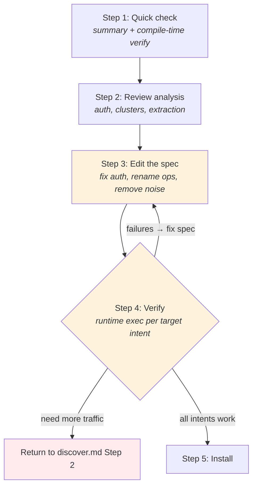

# Compile Reference

How to review, curate, and troubleshoot a compiled site package.

Self-contained — use during `discover.md` Step 5, or standalone when
reviewing an existing site package.

## When to Use

- During discovery Step 5 — compile, curate, verify, diagnose loop
- Standalone — reviewing or editing an existing site package
- Recompiling an existing site with new traffic

## What Compile Already Did

When you arrive here, `openweb compile` has already run the full pipeline:
1. **Analyze** -- labeled traffic, clustered API requests, detected auth, found extraction signals
2. **Auto-curate** -- accepted all clusters, picked top auth candidate, used suggested names
3. **Generate** -- produced `openapi.yaml`, `asyncapi.yaml`, `manifest.json`, test fixtures
4. **Verify** -- replayed safe operations via node HTTP, recorded pass/fail results

Your job is to review these outputs and fix what auto-curation got wrong.

**Important compile-time verify limitations:**
- Compile-time verify always uses `node` transport with plain HTTP fetch.
  Operations that require `page` transport (browser context) will often fail
  with `non_json_response` or `auth_required` -- this is expected, not a bug.
- Compile-time verify only has auth cookies when compile ran with `--probe`.
  Without `--probe`, `verify-report.json` reflects unauthenticated results only.
  For auth-required sites, expect many operations to show `auth_required` unless
  compile had access to browser cookies.

## Artifacts to Review

| Artifact | Location | What to check |
|----------|----------|---------------|
| `summary.txt` | `~/.openweb/compile/<site>/` | Quick overview -- read this first |
| `analysis.json` | `~/.openweb/compile/<site>/` | Analysis report (see reading guide below) |
| `verify-report.json` | `~/.openweb/compile/<site>/` | Per-operation pass/fail with diagnostics |
| `openapi.yaml` | `~/.openweb/sites/<site>/` | Generated HTTP spec -- this is what you edit |
| `asyncapi.yaml` | `~/.openweb/sites/<site>/` | Generated WS spec (if WS traffic) |
| `manifest.json` | `~/.openweb/sites/<site>/` | Package metadata |

## Process



**Exit criterion:** For each target intent, at least one operation returns
real data via `openweb <site> exec <op> '{...}'`.

### Step 1: Quick Check (summary + compile-time verify)

**Read `summary.txt` first** -- one line showing operation count, verify pass rate, auth status.
Example: `8 HTTP ops, 5 verified, 42/120 API samples, auth=detected`

**Then read `verify-report.json`** -- this is the compile-time verify output
produced during `openweb compile`. It is NOT the same format as
`openweb verify <site>`. Check each operation's `overall` status:
- `pass` -- the operation works via node HTTP. Good.
- `skipped` -- write operation, skipped by default. Expected.
- `fail` -- needs investigation. Check `attempts[].reason` and `attempts[].mode`.

**Compile-time verify caveat:** if compile ran without `--probe`, this report has
no auth cookies. For auth-required sites, many operations will show
`attempts[].reason = "auth_required"` even when the auth detection is correct.
Treat that as "auth was not available at compile time", not automatically as a
spec bug.

**Interpreting compile-time verify failures (`verify-report.json`):**

| `reason` | What to check |
|----------|---------------|
| `auth_required` | If compile did not use `--probe`, this often just means auth cookies were unavailable at compile time. If compile did use `--probe` and `mode: "with_auth"` still failed, cookies may be expired or auth detection may be wrong. |
| `non_json_response` | Got HTML instead of JSON. Common for page-transport operations tested via node. If this site needs page transport, this is expected. |
| `client_error` | Check `statusCode`. 404 = wrong path template. 400 = missing required param or bad example value. |
| `server_error` | Upstream 5xx. Retry once. If persistent, it may be a transient upstream problem rather than a spec issue. |
| `timeout` | Site may be slow or may need page transport. Retry once. |
| `network_error` | SSRF blocked? Wrong host? Check the URL. |
| `missing_example` | No example params available to build request. Add `exampleValue` to parameters in the spec. |
| `skipped_unsafe` | Write operation skipped. Not a failure. |
| `ssrf_blocked` | URL resolved to private/internal IP. Check the host. |
| 403 with cookies present | Most operations return 403 even though auth cookies are available. Likely wrong CSRF detection. Check `authCandidates[0].csrfOptions` in analysis.json -- see CSRF Troubleshooting in Step 2a. |

If everything passes and the operation count matches expectations, you may have a
clean compile. Continue to Step 2 for a quality review before installing. If the
report is mostly `auth_required` and compile did not use `--probe`, continue to
analysis/spec review before treating those results as failures.

### Step 2: Review Analysis Report

**DO NOT read the full `analysis.json`.** Read specific sections only.
Skip the `samples` array entirely -- it contains every labeled request and is huge.
Skip the `navigation` array -- it groups requests by page and is only useful for
debugging missing traffic.

#### 2a. Auth Candidates

> Before reading: scan `references/knowledge/auth-patterns.md` "Routing Table"
> to know what auth type to expect for this site's archetype.
> Chinese sites: expect `cookie_session`, possibly with custom signing.
> Google properties: expect `sapisidhash`.
> Public APIs: expect no auth (confidence 0).
> SPA with login: expect `localStorage_jwt` or `exchange_chain`.

Search for `"authCandidates"` in `analysis.json`. Read that array. Check the
top candidate (rank 1):

- **`auth.type`** -- does it match your expectation from the knowledge file?
- **`confidence`** -- above 0.7 is reliable. Below 0.5 is suspect.
- **`evidence.matchedCookies`** -- are these real auth cookies or tracking cookies?
  Known tracking cookies (`__cf_bm`, `_ga`, `__gads`, `datadome`) should NOT
  appear. If they do, the detection has a false positive -- the tracking cookie
  denylist may need updating.
- **`csrf`** -- is CSRF detected? Social sites with write ops usually need it.
  Check `csrf.type` (`cookie_to_header` or `meta_tag`) and the cookie/header names.
- **`evidence.notes`** -- human-readable explanation of why this auth was detected.
  Read this for quick validation.

**If auth looks wrong:** You will edit the generated `openapi.yaml`'s
`servers[0].x-openweb` section manually in Step 3. Note what needs changing now.

#### CSRF Troubleshooting

The auto-detected CSRF may be wrong. Check `authCandidates[0].csrfOptions` in analysis.json --
it lists ALL cookie-to-header matches ranked by confidence.

Common false positives:
- Locale cookies (e.g., `lc-main=en_US` -> `x-li-lang: en_US`) -- short values, not tokens
- Preference cookies -- browser settings forwarded as headers

How to identify the real CSRF:
- Look for headers named `csrf-token`, `x-csrf-token`, `x-csrftoken`
- Look for cookies named `JSESSIONID`, `csrftoken`, `_csrf`
- Real CSRF tokens are long random strings (>10 chars), not short words

To override: re-compile with `--curation` specifying `csrfType`:
```bash
echo '{"csrfType": "cookie_to_header"}' > curation.json
# Then manually edit the generated spec's csrf section if needed
```

#### 2b. Clusters

> For GraphQL sites: read `references/knowledge/graphql-patterns.md` first --
> check the "Persisted Queries" and "Batched Queries" sections to know what
> patterns to look for in the clusters.

Search for `"clusters"` in `analysis.json`. Read that array. For each cluster:

- **`suggestedOperationId`** -- auto-generated names are snake_case heuristics
  based on HTTP method and path (e.g., `list_users`, `get_product`, `search`).
  These often need renaming to be meaningful (e.g., `get_x_graph_ql` should
  become `searchTweets`).
- **`suggestedSummary`** -- derived from the operationId. Usually needs rewriting
  to describe the user action.
- **`method` + `pathTemplate`** -- does the path look correctly normalized?
  - `/users/123` and `/users/456` should normalize to `/users/{id}`
  - If different paths got incorrectly merged, `normalization.originalPaths`
    shows what was collapsed.
- **`graphql`** -- present on GraphQL sub-clusters. Check:
  - `operationName` -- does each GraphQL query get its own cluster?
  - `discriminator` -- how were sub-clusters split? (`operationName`, `queryId`,
    `persistedQueryHash`, or `queryShape`)
  - If all GraphQL requests collapsed into one cluster (no `graphql` field,
    high `sampleCount`), sub-clustering failed. Note this -- you will need to
    manually identify the distinct operations in Step 3.
- **`sampleCount`** -- very high counts (100+) on a single path suggest:
  - GraphQL collapse (see above)
  - A polling endpoint (check if it is a real user-facing operation)
  - Analytics/tracking that was not filtered (should be excluded)
- **`parameters`** -- auto-inferred parameters with types and example values.
  Check that required params are marked required and examples are sensible.
- **`responseVariants`** -- status codes and content types observed. Multiple
  variants (e.g., 200 JSON + 401 JSON) are normal.

Note which clusters to exclude and which operation names to change -- you will
apply these edits to the generated spec in Step 3.

**Noise clusters to look for:**
- Analytics: paths containing `/collect`, `/beacon`, `/pixel`, `/analytics`
- CDN: paths containing `/static/`, `/_next/`, `/assets/`
- Telemetry: WebSocket-only monitoring endpoints
- 4xx-only: clusters where all responseVariants are 4xx status codes

#### 2c. Extraction Signals

> Read `references/knowledge/extraction-patterns.md` -- check the "Decision Flow"
> to understand when extraction is preferred over API replay.

Search for `"extractionSignals"` in `analysis.json`. The array contains:
- `type: "ssr_next_data"` -- Next.js `__NEXT_DATA__` found in HTML.
  `estimatedSize` tells you if there is real data or just a skeleton.
- `type: "script_json"` -- `<script type="application/json">` blocks found.
  `selector` and `id` help you locate the exact element.

**Note:** The analyzer only auto-detects these two patterns. Other extraction types
require manual inspection in the browser:
- `page_global` (e.g., `window.__INITIAL_STATE__`) -- check page source
- `__NUXT__` -- check for `window.__NUXT__` or `window.__NUXT_DATA__` in page source
- `html_selector` -- when data is only in DOM elements, no JSON at all

If API clusters are weak (few samples, noisy responses) but the page has rich SSR
data, extraction may be the better approach. Note this for Step 3.

#### 2d. WebSocket Connections (if present)

> Read `references/knowledge/ws-patterns.md` -- check "Curation Signals" to
> distinguish operations from noise.

Search for `"ws"` at the top level of `analysis.json`:
- `connections[].url` -- is this a real data channel or just telemetry?
- `connections[].executableOperationCount` -- are there meaningful WS operations?
- `connections[].heartbeatCandidates` -- heartbeat interval and payload detected?
- `connections[].operations[]` -- what patterns were found (`subscribe`, `stream`,
  `request_reply`, `publish`)?

Heartbeat-only connections and presence/typing-indicator channels are noise -- exclude them.

### Step 3: Review and Edit the Generated Spec

The generated spec is at `~/.openweb/sites/<site>/openapi.yaml`.
Read it. This is the spec that becomes the site package.

#### 3a. Remove Noise Operations

Delete operations for clusters you identified as noise in Step 2b:
- Analytics/tracking endpoints
- CDN/static asset endpoints
- Polling/heartbeat-only endpoints
- 4xx-only clusters (no successful responses)

#### 3b. Rename Operations

Replace auto-generated `operationId` values with clear, descriptive names.
The auto-names are snake_case heuristics (e.g., `list_users`, `get_product`,
`create_messages`). Rename to match the user action:

- `get_api_v1_search_results` -> `searchProducts`
- `list_graphql` -> `searchUsers` (for GraphQL, name by the operation, not the endpoint)
- `get_users_user` -> `getUserProfile`

Update `summary` to describe the user action, not the URL:
- "Get api v1 search results" -> "Search products by keyword"

**Convention:** Use camelCase for operationId (`searchProducts`, `getUserProfile`).

#### 3c. Fix Auth Configuration

If Step 2a found auth issues, edit the `servers[0].x-openweb` section:
```yaml
servers:
  - url: https://api.example.com
    x-openweb:
      transport: node          # or page
      auth:
        type: cookie_session   # or exchange_chain, localStorage_jwt, etc.
      csrf:
        type: cookie_to_header
        cookie: ct0
        header: x-csrf-token
```

Refer to `references/knowledge/auth-patterns.md` for the exact structure
of each auth primitive type.

#### 3d. Set Permissions and Replay Safety

For each operation, check `x-openweb.permission` and `x-openweb.risk_tier`:
- GET/HEAD -> `permission: read`, `risk_tier: safe`
- GraphQL queries -> `permission: read`, `risk_tier: safe`
- POST/PUT/PATCH (mutations) -> `permission: write`, `risk_tier: unsafe`
- DELETE -> `permission: delete`, `risk_tier: unsafe`
- GraphQL mutations -> `permission: write`, `risk_tier: unsafe`

Auto-curation defaults are usually correct, but check GraphQL queries that use
POST method -- they should be `read` + `safe`, not `write` + `unsafe`. The
auto-curation already handles this (checks `graphql.operationType === 'query'`),
but verify.

#### 3e. Review Examples for PII

Check parameter examples in the spec and test fixtures (`tests/*.test.json`):
- Real usernames, emails, phone numbers, addresses? Replace with generic values.
- Auth tokens or session IDs in examples? Remove.
- The scrubber catches common patterns, but flag anything it might miss.

#### 3f. Extraction Complexity Rule

If an operation uses SSR extraction and the `expression` exceeds ~5 lines,
extract it into an adapter file:

```
src/sites/<site>/
  openapi.yaml          <- references adapter, no inline JS
  adapters/<site>.ts    <- complex DOM parsing logic lives here
```

In openapi.yaml:
```yaml
x-openweb:
  adapter: ./adapters/<site>.ts
```

**Inline is OK for:** simple `ssr_next_data`, `page_global`, short `html_selector` (1-3 lines).
**Adapter is required for:** multi-line DOM queries, regex parsing, complex data transformation.

### Step 4: Verify

After editing the spec, verify it works at runtime. Two levels: batch verify
(sanity check) and runtime exec (the real exit gate).

#### 4a. Batch verify

```bash
openweb verify <site>
```

This runs the lifecycle verifier against the installed site package. Its output
format is different from `verify-report.json`.

`openweb verify <site>` reports lifecycle statuses:
- `PASS` -- operation/site verified successfully
- `DRIFT` -- the site still works, but the response shape changed
- `FAIL` -- execution failed
- `auth_expired` -- auth-only failures (login/session issue)

| Status | What it means | What to do |
|--------|----------------|------------|
| `PASS` | Works. Continue to runtime exec. | |
| `DRIFT` | Works but response shape changed. | Re-compile or update fixtures if intentional. Document if transient. |
| `auth_expired` | Login/session expired. | `openweb login <site>`, `openweb browser restart`, rerun verify. |
| `FAIL` | Execution failed. | Read detail line. Fix spec or environment and rerun. |
| `FAIL` (403 with cookies) | Most ops return 403 even with valid cookies. | Wrong CSRF -- check `authCandidates[0].csrfOptions` in analysis.json. See CSRF Troubleshooting in Step 2a. |

#### 4b. Runtime exec — the exit gate

Batch verify checks HTTP sanity. Runtime exec proves an agent can get usable data.

For each target intent, exec the best operation:

```bash
openweb <site> exec <operation> '{"param": "value"}'
```

**Exit criterion:** Each target intent has at least one operation that returns
real data — HTTP 2xx, valid JSON, non-empty response with expected fields.

If all pass → continue to Step 5 (install).
If any fail → diagnose below.

Common issues at this stage:
- `needs_browser` → run `openweb browser start`
- `needs_login` → log in to the site in the managed browser
- Hangs → check if token cache is stale (restart browser)
- Empty response → the API may need different parameters

#### 4c. Diagnose + fix

When runtime exec fails, diagnose the root cause and fix the spec.
Do not re-capture unless the problem is missing traffic.

| Response | Likely cause | Fix |
|----------|-------------|-----|
| 403 | Wrong CSRF config, missing headers, expired session | Check CSRF cookie/header names. Check if CSRF scope excludes GET. Check for extra required headers. If cookies missing: `openweb login <site>` |
| 401 | Session expired | `openweb login <site>`, restart browser |
| 999 / bot block | Node transport hitting bot detection | Switch to `page` transport |
| 200 HTML (not JSON) | SSR page endpoint, not API | Remove op and use API equivalent, or add extraction config |
| 404 | Wrong path template | Fix path parameter normalization in spec |
| 400 | Bad param examples or missing required params | Update `exampleValue` fields in spec |
| 200 empty/wrong data | Wrong query variables or response schema | Check captured request params vs what you're sending |
| Timeout / hang | Stale token cache, browser not running | `openweb browser restart`, clear token cache |
| Redirect loop | Auth-gated endpoint, not logged in | Log in, or remove endpoint |

After fixing the spec, return to Step 4a. If the fix requires more captured
traffic (missing endpoints, wrong API domain), return to `discover.md` Step 2
for re-capture.

#### 4d. WS Verification

If AsyncAPI operations are present:
- Can the WebSocket connect with the detected auth?
- Does the heartbeat interval match?
- Do subscribe operations receive expected event types?

### Step 5: Install the Site Package

When all operations pass verification (or failures are understood and documented):

#### 5a. Copy to source tree

Copy the generated package from `~/.openweb/sites/<site>/` to `src/sites/<site>/`:

```bash
mkdir -p src/sites/<site>
cp ~/.openweb/sites/<site>/openapi.yaml src/sites/<site>/
cp ~/.openweb/sites/<site>/manifest.json src/sites/<site>/
# Copy asyncapi.yaml only if WS operations are present
# Copy tests/ directory
```

If the site already has a package, merge carefully -- do not lose existing
adapter files, DOC.md, or PROGRESS.md.

#### 5b. Write DOC.md

Create or update `src/sites/<site>/DOC.md` per `references/site-doc.md`:
- Auth type, transport, extraction patterns
- Map operations to target intents
- Write operation safety levels
- Known issues (bot detection, rate limits, dynamic fields causing drift)

#### 5c. Write PROGRESS.md

Append the first entry (or a new entry) to `src/sites/<site>/PROGRESS.md`:
```markdown
## YYYY-MM-DD: Initial compile (or: Added N operations)

**What changed:**
- Compiled N HTTP operations, M WS operations
- Auth: <type>, Transport: <type>

**Verification:** N/M passed
```

#### 5d. Build and test

```bash
pnpm build && pnpm test
```

Ensure the new site package is recognized by the CLI:
```bash
openweb sites          # should list the new site
openweb <site>         # should show operations
```

#### 5e. Update knowledge (if applicable)

If you learned something new during compile that generalizes across sites,
write it to `references/knowledge/` per `references/update-knowledge.md`.

## Execution Model Decision

When reviewing the generated spec, decide on the transport for each operation.

### Transport Selection

```
Can node make the request without cookies?
  |-- Yes -> node transport (fastest)
  |-- No -> Does the site use bot detection (Akamai/PX/DataDome)?
       |-- No/light (basic Cloudflare) -> node + browser cookie extraction
       |-- Heavy -> page transport
            |-- Does page need specific JS context (signing, encryption)?
                 |-- No -> page with evaluate
                 |-- Yes -> adapter transport
```

> Read `references/knowledge/bot-detection-patterns.md` "Impact on Transport Selection"
> for the detailed decision tree.

### Does data come from WebSocket?

Yes -> curate WS operations in `asyncapi.yaml` alongside HTTP operations.
Review each protocol independently. A site package is ready only when all
useful protocols are curated.

## Common False Positives

- **Tracking cookies as auth**: Cloudflare, GA, Meta pixel cookies trigger
  `cookie_session` detection. Check `authCandidates[].evidence.matchedCookies`
  for tracking cookie names (`__cf_bm`, `_ga`, `__gads`). If you see these,
  the auth candidate is a false positive. Check if a lower-ranked candidate
  is better, or if the site is actually public (no auth needed).
- **Analytics as operations**: `/collect`, `/beacon`, `/pixel` -- remove in Step 3a.
- **Dashboard noise**: SaaS dashboards generate heavy internal namespace traffic.
  Manual curation must filter these.
- **Heartbeat-only WS**: WebSocket connections with only ping/pong -- not operations.
- **4xx responses as operations**: 401/403/404 clusters appear because the
  analyzer does not filter by status. These clusters indicate auth-required
  endpoints or stale URLs -- cross-reference with `authCandidates`.

## Common False Negatives

- **Auth not detected**: User was not logged in, or unsupported auth pattern.
  Check `authCandidates` -- if the only candidate has `confidence: 0` and the
  `evidence.rejectedSignals` says "No cookie session overlap found", the user
  was probably not logged in during capture. Re-capture with login.
- **CSRF not detected**: Token embedded in JavaScript (not cookie/meta tag).
  Identify manually in browser dev tools and add to spec.
- **Operations missing**: Key pages not visited during capture. Return to
  `discover.md` for targeted browsing.
- **Cross-domain API**: Site calls a different domain. Check `summary.byCategory.off_domain`.
  Re-compile with the API domain or use a multi-server spec.
- **GraphQL collision**: Multiple operations collapsed into one cluster.
  Need capture with more varied queries. Check for missing `graphql` sub-cluster metadata.

## Anti-pattern: Probing with curl/fetch

**NEVER** test endpoints with curl, wget, fetch, or any direct HTTP tool.
This poisons IP reputation with bot detection systems and can block even
real browser sessions on the same IP. See `discover.md` "Browser First" rule.

Use `openweb verify <site>` instead -- it uses the proper transport and auth.

## Related References

- `references/discover.md` -- coverage responsibility, capture workflow
- `references/site-doc.md` -- DOC.md / PROGRESS.md template
- `references/update-knowledge.md` -- when to write cross-site patterns
- `references/knowledge/archetypes/index.md` -- per-archetype curation expectations
- `references/knowledge/auth-patterns.md` -- auth primitive structures
- `references/knowledge/graphql-patterns.md` -- GraphQL sub-clustering and curation
- `references/knowledge/extraction-patterns.md` -- SSR/DOM extraction techniques
- `references/knowledge/ws-patterns.md` -- WS connection/message patterns
- `references/knowledge/troubleshooting-patterns.md` -- failure diagnosis patterns
