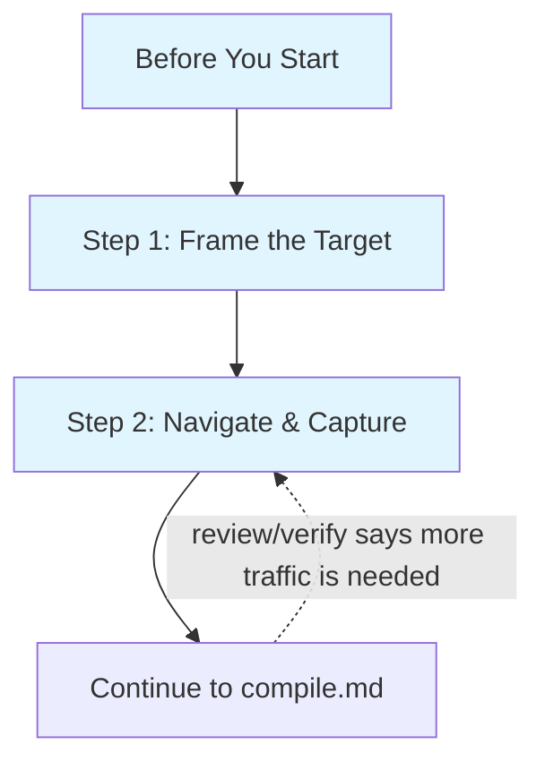

# Discovery Process

How to add a new site or expand an existing site's operation coverage.

**Responsibility:** Frame target intents, navigate the site, and capture
traffic. After capture, hand off to `compile.md` for compilation, review,
curation, verification, and installation.

## When to Use

- User asks about a site with no site package
- Expanding coverage for an existing site (more operations, new protocols)
- Site package is stale or has auth/transport issues

## Before You Start

Read these knowledge files in order — but scale depth to context:

- **Existing site (rediscovery/update):** Read the site's prior-round `DOC.md`
  and `openapi.yaml` from the first available source:
  1. `src/sites/<site>/` (worktree)
  2. `$OPENWEB_HOME/sites/<site>/` (compile cache; default `~/.openweb/sites/<site>/`)
  3. `git show HEAD:src/sites/<site>/DOC.md` (if files deleted from worktree)
  Focus on: auth config, write endpoint paths, adapter/transport requirements,
  known issues (signing, SSR-only endpoints). Skim the archetype row for anything
  the DOC.md missed. Skip bot-detection unless you hit blocks.
- **Net-new site:** Read all three files below. Each produces a concrete decision
  that shapes your capture strategy.

1. **`references/knowledge/archetypes/index.md`** — identify the archetype row.
   Then read the linked profile (e.g., `social.md`, `commerce.md`).
   **Decision:** What operations should I target? What auth and transport to expect?
   Archetypes are heuristic starting points — define targets based on user needs,
   not copied from archetype templates.

2. **`references/knowledge/bot-detection-patterns.md`** — check the "Detection Systems"
   section for the site (or similar sites in the same vertical).
   **Decision:** Do I need a real Chrome profile (Akamai/PX/DataDome) or will any
   browser work? Should I keep capture sessions short?

3. **`references/knowledge/auth-patterns.md`** — scan the "Routing Table" at the top.
   **Decision:** Should I log in before capture?
   - Chinese web sites: usually `cookie_session` with custom signing
   - Google properties: `sapisidhash`
   - Reddit-like SPAs: `exchange_chain`
   - Public APIs: likely no auth needed
   If you expect auth, log in first — unauthenticated capture misses auth-required
   endpoints entirely, wasting the capture session.

   **Auth types that CANNOT be auto-detected:**
   - `page_global` — API keys embedded in page JavaScript (e.g., YouTube
     INNERTUBE_API_KEY). Must be manually identified by inspecting page source
     for global variable assignments containing API keys.
   - `webpack_module_walk` — tokens stored in webpack module closures (e.g.,
     Discord). Must be manually specified. The runtime supports it; the
     compiler cannot discover it.

   If the existing package uses these auth types, PRESERVE them during merge
   (see `spec-curation.md` "Merge with Existing Package").

## Critical Rules

### Browser First, No Direct HTTP

**NEVER use curl, fetch, wget, or any direct HTTP request to probe a site.**
Not even to "check if it works" or "see what the response looks like."

Bot detection systems track IP reputation across all requests. A single curl request
registers as non-browser traffic and raises the IP's risk score. Multiple probes
escalate to an IP-level block that poisons subsequent browser sessions too.

**Always use the managed browser.** If the browser hits a CAPTCHA, that is the time
to decide whether to solve it or declare the site blocked.

### Write Operation Safety

When discovering write operations (POST/PUT/PATCH/DELETE), capture the traffic but
be cautious. Mark each write in DOC.md with a safety level.

| Level | Examples | Rule |
|-------|----------|------|
| SAFE | like, bookmark, follow, add-to-cart | Capture freely, reversible |
| CAUTION | send message (to self), post (then delete) | Only in safe contexts |
| NEVER | purchase, delete account, send to others | Do not trigger during discovery |

Verify skips write operations by default (internally `replaySafety: unsafe_mutation`).

## Process



### Step 1: Frame the Target

Define 3-5 target intents as **user actions**, not API names.

- If the user asked for specific operations, those are your targets.
- Otherwise, derive from the archetype profile and user needs.
- Create or update `src/sites/<site>/DOC.md` with an initial overview and a
  target-intent checklist (following `references/site-doc.md`).

**Good target intents:**
- E-commerce: "search products by keyword", "get product detail page", "get reviews for a product"
- Social: "search posts by keyword", "get post with comments", "get user profile"
- Travel: "search flights by route and date", "get pricing details"

#### Write Operation Discovery

After framing read intents, add write intents for the site's core interactions:

| Archetype | Typical write intents |
|-----------|----------------------|
| Social | like/upvote, follow/unfollow, bookmark/save, repost/share |
| E-commerce | add to cart, add to wishlist |
| Messaging | send message (to self/test channel only) |
| Content | post content (then delete), comment |

These use the same capture flow — perform the action in the browser during
Step 2. The safety table above applies. Perform ALL safe write actions during
capture: like, follow, bookmark, repost/share. Each triggers a different API
endpoint. Missing a write action means missing that operation entirely — write
endpoints cannot be inferred from read traffic.

### Step 2: Navigate and Capture

**Read `references/capture-guide.md` now.** It covers capture modes (UI
browsing vs direct API calls), auth injection, scripted capture, multi-worker
sharing, and troubleshooting.

#### Start Capture

```bash
openweb browser start
openweb capture start --isolate --url https://<site-domain> --cdp-endpoint http://localhost:9222
```

`--isolate` creates a dedicated tab and records only that tab's traffic.
Without it, capture records all tabs — fine for single-site interactive use,
but causes cross-site contamination when multiple tabs are open.

The capture output goes to `$OPENWEB_HOME/captures/<session-id>/`. Do not
use the project root for capture artifacts.

#### Browse per Target Intents

Browse the site in the capture tab to trigger each target intent from Step 1.
See `capture-guide.md` for detailed browsing tips, direct API call patterns,
and write action techniques.

#### Stop Capture

```bash
openweb capture stop --session <session-id>
```

The capture directory contains `traffic.har`, `state_snapshots/`, and
optionally `websocket_frames.jsonl`.

## Handoff to `compile.md`

After capture, continue to `compile.md` for the full post-capture workflow:
compile, review, curate, verify, and install.

## Incremental Discovery (Existing Sites)

Follow the "Before You Start" fast-path (reads existing DOC.md + openapi.yaml),
identify gaps, then enter at Step 2 for targeted capture.

When expanding an existing site, you already have operation IDs and paths from
the prior package. Use these to focus capture on the missing intents only.

When rediscovering detail endpoints, use the **Workflows** section of the site's
DOC.md to find chain dependencies (e.g., `listGuilds → guildId → getGuildInfo`).
Do not hardcode IDs from prior captures — they may be expired or invalid.
Execute a list operation to get fresh IDs, then use those for detail endpoint
capture.

## Adapter-Only Sites

Some sites use proprietary protocols or deliver all data via HTML (no JSON API).
For these, the standard capture → compile flow produces no usable operations.

**Signals that a site needs an adapter:**
- Compile produces 0 `api`-labeled samples (all `static` or `off_domain`)
- All data is in SSR HTML, LD+JSON, or DOM (no XHR/fetch JSON responses)
- Site uses a proprietary protocol (e.g., Telegram MTProto)

**Probing checklist before committing to adapter-only:**
1. Open DevTools Network tab, filter by XHR/Fetch, and browse the site. If zero
   JSON responses appear, the site is SSR/DOM-only.
2. Check `view-source:` for `__NEXT_DATA__`, `__INITIAL_STATE__`, or LD+JSON
   (`<script type="application/ld+json">`). These are extraction targets, not
   adapter-only signals — use `x-openweb.extraction` instead.
3. Try a search with the on-page search box (not URL bar). Some sites serve SSR
   for direct navigation but use JSON APIs for in-app search/pagination.
4. If the site has a mobile app, check if it calls a public API that the web
   version does not use — this is rare but sometimes reveals a hidden JSON API.

**Adapter-only workflow:**
1. Frame target intents (Step 1 — same as normal)
2. Write adapter directly: `src/sites/<site>/adapters/<site>.ts`
3. Write openapi.yaml manually (operations, schemas, x-openweb with adapter transport)
4. Create example files manually
5. Verify with `openweb verify <site>`

See `capture-guide.md` "Scripted Capture" for adapter templates.

## Related References

- `references/compile.md` — post-capture process (compile, review, curate, verify, install, learn)
- `references/capture-guide.md` — capture techniques, scripted capture, multi-worker, troubleshooting
- `references/analysis-review.md` — how to read `analysis.json`
- `references/spec-curation.md` — how to clean and configure generated specs
- `references/site-doc.md` — DOC.md / PROGRESS.md template
- `references/update-knowledge.md` — when to write cross-site patterns
- `references/knowledge/archetypes/index.md` — site type expectations
- `references/knowledge/auth-patterns.md` — auth primitive detection
- `references/knowledge/bot-detection-patterns.md` — anti-bot measures
- `references/knowledge/troubleshooting-patterns.md` — failure diagnosis patterns
