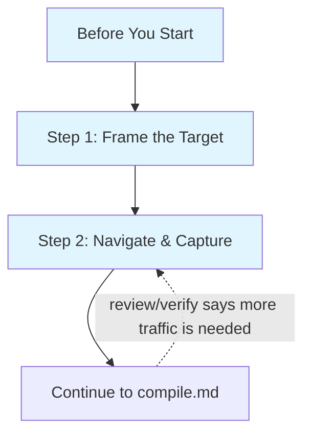

# Discovery Process

How to add a new site or expand an existing site's operation coverage.

**Responsibility:** Frame target intents, navigate the site, and capture
traffic. After capture, hand off to `compile.md` for compilation, review,
curation, verification, and installation.

## When to Use

- User asks about a site with no site package
- Expanding coverage for an existing site (more operations, new protocols)
- Site package is stale or has auth/transport issues

## Before You Start

Read these knowledge files in order — but scale depth to context:

- **Existing site (rediscovery/update):** Read the site's prior-round `DOC.md`
  and `openapi.yaml` from the first available source:
  1. `src/sites/<site>/` (worktree)
  2. `~/.openweb/sites/<site>/` (compile cache)
  3. `git show HEAD:src/sites/<site>/DOC.md` (if files deleted from worktree)
  Focus on: auth config, write endpoint paths, adapter/transport requirements,
  known issues (signing, SSR-only endpoints). Skim the archetype row for anything
  the DOC.md missed. Skip bot-detection unless you hit blocks.
- **Net-new site:** Read all three files below. Each produces a concrete decision
  that shapes your capture strategy.

1. **`references/knowledge/archetypes/index.md`** — identify the archetype row.
   Then read the linked profile (e.g., `social.md`, `commerce.md`).
   **Decision:** What operations should I target? What auth and transport to expect?
   Archetypes are heuristic starting points — define targets based on user needs,
   not copied from archetype templates.

2. **`references/knowledge/bot-detection-patterns.md`** — check the "Detection Systems"
   section for the site (or similar sites in the same vertical).
   **Decision:** Do I need a real Chrome profile (Akamai/PX/DataDome) or will any
   browser work? Should I keep capture sessions short?

3. **`references/knowledge/auth-patterns.md`** — scan the "Routing Table" at the top.
   **Decision:** Should I log in before capture?
   - Chinese web sites: usually `cookie_session` with custom signing
   - Google properties: `sapisidhash`
   - Reddit-like SPAs: `exchange_chain`
   - Public APIs: likely no auth needed
   If you expect auth, log in first — unauthenticated capture misses auth-required
   endpoints entirely, wasting the capture session.

   **Auth types that CANNOT be auto-detected:**
   - `page_global` — API keys embedded in page JavaScript (e.g., YouTube
     INNERTUBE_API_KEY). Must be manually identified by inspecting page source
     for global variable assignments containing API keys.
   - `webpack_module_walk` — tokens stored in webpack module closures (e.g.,
     Discord). Must be manually specified. The runtime supports it; the
     compiler cannot discover it.

   If the existing package uses these auth types, PRESERVE them during merge
   (see `compile.md` Step 5 "Merging with an Existing Package").

## Critical Rules

### Browser First, No Direct HTTP

**NEVER use curl, fetch, wget, or any direct HTTP request to probe a site.**
Not even to "check if it works" or "see what the response looks like."

Bot detection systems track IP reputation across all requests. A single curl request
registers as non-browser traffic and raises the IP's risk score. Multiple probes
escalate to an IP-level block that poisons subsequent browser sessions too.

**Always use the managed browser.** If the browser hits a CAPTCHA, that is the time
to decide whether to solve it or declare the site blocked.

### Write Operation Safety

When discovering write operations (POST/PUT/PATCH/DELETE), capture the traffic but
be cautious. Mark each write in DOC.md with a safety level.

| Level | Examples | Rule |
|-------|----------|------|
| SAFE | like, bookmark, follow, add-to-cart | Capture freely, reversible |
| CAUTION | send message (to self), post (then delete) | Only in safe contexts |
| NEVER | purchase, delete account, send to others | Do not trigger during discovery |

Verify skips write operations by default (internally `replaySafety: unsafe_mutation`).

## Process



### Step 1: Frame the Target

Define 3-5 target intents as **user actions**, not API names.

- If the user asked for specific operations, those are your targets.
- Otherwise, derive from the archetype profile and user needs.
- Create or update `src/sites/<site>/DOC.md` with an initial overview and a
  target-intent checklist (following `references/site-doc.md`).

**Good target intents:**
- E-commerce: "search products by keyword", "get product detail page", "get reviews for a product"
- Social: "search posts by keyword", "get post with comments", "get user profile"
- Travel: "search flights by route and date", "get pricing details"

#### Write Operation Discovery

After framing read intents, add write intents for the site's core interactions:

| Archetype | Typical write intents |
|-----------|----------------------|
| Social | like/upvote, follow/unfollow, bookmark/save, repost/share |
| E-commerce | add to cart, add to wishlist |
| Messaging | send message (to self/test channel only) |
| Content | post content (then delete), comment |

These use the same capture flow — perform the action in the browser during
Step 2. The safety table above applies. Perform ALL safe write actions during
capture: like, follow, bookmark, repost/share. Each triggers a different API
endpoint. Missing a write action means missing that operation entirely — write
endpoints cannot be inferred from read traffic.

### Step 2: Navigate and Capture

#### Start Capture

```bash
openweb browser start
openweb capture start --cdp-endpoint http://localhost:9222
```

#### Choose Capture Mode: UI Navigation vs `page.evaluate(fetch)`

Both modes produce HAR traffic that the compiler ingests. Use them together
in each capture session — UI browsing discovers endpoints you don't know about;
direct calls fill known coverage gaps.

#### Browsing Tips

Browse the site systematically in the managed browser to trigger each target intent:
- Do a search (triggers search API)
- Click into a result (triggers detail API)
- Scroll or paginate (triggers pagination)
- Check other features (reviews, profile, settings)

Tips:
- **Vary your inputs** — use 2-3 different search terms for better schema inference.
- **Wait for content to load** before navigating away.
- **Click through UI tabs** on profiles and feeds — each tab triggers a different
  API endpoint. Hit the top 2-3 tabs.
- **Search: use the on-page search box**, not URL navigation. `page.goto()` to
  a search URL delivers SSR HTML; typing in the SPA search widget triggers the
  JSON API endpoint.
- **If the site requires login**, log in in the managed browser. For net-new
  sites, `openweb login <site>` won't work — authenticate via the target URL
  directly. Existing Chrome profile logins may carry over.
- **Trigger write actions** after browsing read flows: like a post, follow a user,
  bookmark content. See Write Operation Safety table above for safe actions.

  **Executing write actions programmatically:**

  *Approach 1 — Click UI buttons* (when selectors are findable):
  Navigate to a content detail page. Find the button using common selectors
  (`[class*="like"]`, `[aria-label*="like"]`, `[data-action="like"]`), scroll it
  into view, click, wait 2s for the POST to fire. If `.click()` doesn't trigger
  the API call, try `dispatchEvent(new MouseEvent('click', {bubbles: true}))`.

  *Approach 2 — Call write APIs directly* (preferred — see Direct API Calls below):
  Use `page.evaluate(fetch('/api/endpoint', {method:'POST', credentials:'same-origin'}))`.
  Read the CSRF token from `document.cookie` if the site uses CSRF. Find write
  endpoint paths in the site's prior-round DOC.md or openapi.yaml — write
  endpoints cannot be discovered from read traffic alone.

  After each write action, trigger the reverse to capture both sides (like/unlike,
  follow/unfollow, bookmark/unbookmark).
- **If you expect auth-required operations:** Log in FIRST, then capture.
  Auth detection requires seeing auth tokens in the traffic. Specifically:
  - **exchange_chain (Reddit-like):** Do a COLD page load (clear cookies or
    incognito) so the token exchange request appears in the HAR.
  - **sapisidhash (Google/YouTube):** Must be logged into a Google account.
    SAPISID cookie and `SAPISIDHASH` Authorization headers must appear in HAR.
  - **cookie_session with CSRF:** Perform at least one mutation (like, follow)
    so the CSRF token appears in POST request headers.
- **Avoid** logout, delete account, billing, irreversible actions.

**SPA navigation rule:** Use **in-app navigation** (click links in the UI), not
address-bar navigation or `window.location.href`. Full-page reloads deliver data
via SSR — JSON API calls only fire during SPA client-side routing. For
programmatic browsing: `element.click()` on links, not `Page.navigate`.

#### Direct API Calls via `page.evaluate(fetch)`

Calling APIs directly from the page context is often the most reliable capture
method — more reliable than hoping UI clicks trigger the right requests:

```javascript
await page.evaluate(() => fetch('/api/endpoint?param=value', {
  credentials: 'same-origin'
}));
```

**When to prefer direct fetch over SPA navigation:**
- POST-based APIs (Innertube, GraphQL) — clicks may not send the right body
- You know the API pattern but can't find the UI button
- You want multiple samples with varied parameters for better schema inference
- REST endpoints are more stable than GraphQL `doc_id` hashes

**Combine with UI browsing:** Direct calls fill known coverage gaps; UI browsing
discovers endpoints you don't know about. Use both in each capture session.

**Same-origin only.** `page.evaluate(fetch(...))` is blocked by CORS for
cross-origin URLs. Navigate to the target subdomain first, then use relative paths.

#### Non-Cookie Auth Injection

`credentials: 'same-origin'` only carries cookie-based auth. For sites using
non-cookie auth (`webpack_module_walk`, `localStorage_jwt`, `page_global`),
you must extract the token and inject it as a header:

```javascript
// Extract token (method depends on auth type)
const token = await page.evaluate(() => {
  // localStorage_jwt:
  return localStorage.getItem('auth_token');
  // page_global:
  // return window.__AUTH_TOKEN__;
});

// Inject into fetch
await page.evaluate((t) => fetch('/api/endpoint', {
  headers: { 'Authorization': `Bearer ${t}` },
}), token);
```

Check the site's `openapi.yaml` auth config to determine the correct extraction
method and header name.

#### Two-Phase Programmatic Capture

For complex programmatic capture (many endpoints, varied parameters), use a
two-phase approach instead of inline `page.evaluate` calls:

1. **Phase 1 — Capture:** `openweb capture start` → run your script (Playwright,
   CDP, or manual browsing) → `openweb capture stop`
2. **Phase 2 — Compile:** `openweb compile <site-url> --capture-dir ./capture`

This separates capture from compilation, giving you direct stderr visibility
during the script phase and allowing fast iteration without restarting the
full pipeline.

#### Capture Target Binding

Capture is **browser-wide**, not single-tab. On start, it attaches HAR + WS
recording to `pages()[0]`, then auto-attaches to every new tab opened
afterwards via `context.on('page')`. Pre-existing tabs (opened before capture
started) are NOT monitored, except `pages()[0]`.

What this means in practice:
1. **Start capture FIRST**, then open new tabs — they auto-attach.
2. **Pre-existing tabs are blind spots.** If you opened tabs before capture,
   their traffic won't appear in the HAR.
3. **`page.evaluate(fetch(...))` works** on any monitored page — the initial
   page or any tab opened after capture started.
4. **Separate Playwright connections don't work.** A `page.evaluate(fetch())`
   on a Page from a different Playwright `connect()` call uses a Page object
   that capture doesn't monitor. Use CDP on the existing browser context, or
   navigate in a tab that capture already tracks.

**Verification:** After capture, check `summary.byCategory.api`. If it's 0
despite browsing, traffic likely came from a pre-existing tab or a separate
Playwright connection.

#### Stop Capture and Artifacts

```bash
openweb capture stop
```

The capture directory (default `./capture/`) now contains `traffic.har`,
`state_snapshots/`, and optionally `websocket_frames.jsonl`.

#### Capture Troubleshooting

| Symptom | Cause | Fix |
|---------|-------|-----|
| HAR has 0 API entries for target site | Browsing happened in a pre-existing tab (opened before capture) | Start capture first, then open a NEW tab for the site |
| `page.evaluate(fetch())` not in HAR | Fetch ran on a Page from a separate Playwright connection | Use CDP on the capture's browser context, or navigate a monitored tab |
| `No active capture session` on stop | Stale PID file or process killed | `pkill -f "capture start"`, delete PID file, restart |
| HAR empty / truncated | Process killed before flush | Stop with `openweb capture stop`, never `kill -9` |
| Another worker's stop kills your data | Global capture stop | Use Playwright `context.recordHar()` for isolated capture |

## Handoff to `compile.md`

After capture, continue to `compile.md` for the full post-capture workflow:
compile, review, curate, verify, and install.

## Incremental Discovery (Existing Sites)

Follow the "Before You Start" fast-path (reads existing DOC.md + openapi.yaml),
identify gaps, then enter at Step 2 for targeted capture.

### Existing-Site Fast Path

When expanding an existing site, you already have operation IDs and paths from
the prior package. Use these to focus capture on the missing intents only.

### Chain-ID Rediscovery

When rediscovering detail endpoints, use list endpoints first to get real
entity IDs, then chain into detail calls:

```
listGuilds → pick guildId → getGuildInfo, listGuildChannels
```

Do not hardcode IDs from prior captures — they may be expired or invalid.
Execute a list operation to get fresh IDs, then use those IDs for detail
endpoint capture.

## Multi-Worker Browser Sharing

Multiple workers can share one Chrome browser on the same CDP port:
1. **ONE worker starts capture** — it's browser-wide, not per-tab.
2. **Each worker opens a NEW tab** after capture starts (auto-attached via
   `context.on('page')`). Do NOT close or navigate other workers' tabs.
3. **Workers browse in their own tabs.** All tabs' traffic merges into one
   HAR. The compile command filters by site URL.
4. **Last worker to finish** triggers `capture stop`.
5. For **same-site parallel capture**, use separate browser instances on different
   CDP ports, or capture sequentially.
6. If `capture start` is already running (another worker started it), skip it —
   your new tabs are auto-attached and traffic is already being recorded.

## Related References

- `references/compile.md` — post-capture process (compile, review, curate, verify, install)
- `references/analysis-review.md` — how to read `analysis.json`
- `references/spec-curation.md` — how to clean and configure generated specs
- `references/site-doc.md` — DOC.md / PROGRESS.md template
- `references/update-knowledge.md` — when to write cross-site patterns
- `references/knowledge/archetypes/index.md` — site type expectations
- `references/knowledge/auth-patterns.md` — auth primitive detection
- `references/knowledge/bot-detection-patterns.md` — anti-bot measures
- `references/knowledge/troubleshooting-patterns.md` — failure diagnosis patterns
