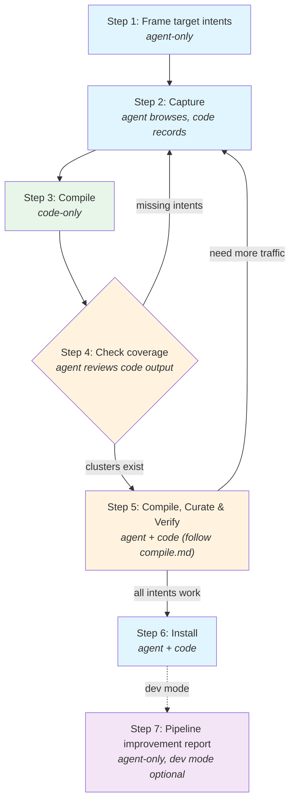

# Discovery Process

How to add a new site or expand an existing site's operation coverage.

**Responsibility:** Full journey — from target intents to working operations.
Coverage (are target intents in the traffic?) AND correctness (do ops return
real data at runtime?). `compile.md` is the reference guide for spec curation
and troubleshooting — used in Step 5 below.

## When to Use

- User asks about a site with no site package
- Expanding coverage for an existing site (more operations, new protocols)
- Site package is stale or has auth/transport issues

## Before You Start

Read these knowledge files in order. Each one produces a concrete decision that
shapes your capture strategy. Do not skip this -- wrong assumptions here waste
entire capture/compile cycles.

1. **`references/knowledge/archetypes/index.md`** -- identify the archetype row.
   Then read the linked profile (e.g., `social.md`, `commerce.md`).
   **Decision:** What operations should I target? What auth and transport to expect?
   Archetypes are heuristic starting points -- define targets based on user needs,
   not copied from archetype templates.

2. **`references/knowledge/bot-detection-patterns.md`** -- check the "Detection Systems"
   section for the site (or similar sites in the same vertical).
   **Decision:** Do I need a real Chrome profile (Akamai/PX/DataDome) or will any
   browser work? Should I keep capture sessions short?

3. **`references/knowledge/auth-patterns.md`** -- scan the "Routing Table" at the top.
   **Decision:** Should I log in before capture?
   - Chinese web sites: usually `cookie_session` with custom signing
   - Google properties: `sapisidhash`
   - Reddit-like SPAs: `exchange_chain`
   - Public APIs: likely no auth needed
   If you expect auth, log in first -- unauthenticated capture misses auth-required
   endpoints entirely, wasting the capture session.

   **Auth types that CANNOT be auto-detected:**
   - `page_global` -- API keys embedded in page JavaScript (e.g., YouTube
     INNERTUBE_API_KEY). Must be manually identified by inspecting page source
     for global variable assignments containing API keys.
   - `webpack_module_walk` -- tokens stored in webpack module closures (e.g.,
     Discord). Must be manually specified. The runtime supports it; the
     compiler cannot discover it.

   If the existing package uses these auth types, PRESERVE them during merge
   (see compile.md "Merging with an Existing Package").

4. **If the site already has a package:** read its `DOC.md` and `openapi.yaml`
   (at `src/sites/<site>/`) to understand current coverage before capturing more.

## Critical Rule: Browser First, No Direct HTTP

**NEVER use curl, fetch, wget, or any direct HTTP request to probe a site.**
Not even to "check if it works" or "see what the response looks like."

Bot detection systems track IP reputation across all requests. A single curl request
registers as non-browser traffic and raises the IP's risk score. Multiple probes
escalate to an IP-level block that poisons subsequent browser sessions too.

**Always use the managed browser.** If the browser hits a CAPTCHA, that is the time
to decide whether to solve it or declare the site blocked.

## Write Operation Safety

When discovering write operations (POST/PUT/PATCH/DELETE), capture the traffic but
be cautious. Mark each write in DOC.md with a safety level.

| Level | Examples | Rule |
|-------|----------|------|
| SAFE | like, bookmark, follow, add-to-cart | Capture freely, reversible |
| CAUTION | send message (to self), post (then delete) | Only in safe contexts |
| NEVER | purchase, delete account, send to others | Do not trigger during discovery |

Verify skips write operations by default (`replaySafety: unsafe_mutation`).

## Process



**Legend:** 🟦 blue = agent-driven | 🟩 green = code-only | 🟧 orange = agent reviews code output | 🟪 purple = dev mode optional

### Step 1: Frame the Target

Define 3-5 target intents as **user actions**, not API names.

- If the user asked for specific operations, those are your targets.
- Otherwise, derive from the archetype profile and user needs.
- Create or update `src/sites/<site>/DOC.md` with an initial overview and a
  target-intent checklist (following `references/site-doc.md`).

**Good target intents:**
- E-commerce: "search products by keyword", "get product detail page", "get reviews for a product"
- Social: "search posts by keyword", "get post with comments", "get user profile"
- Travel: "search flights by route and date", "get pricing details"

#### Write Operation Discovery

After framing read intents, add write intents for the site's core interactions:

| Archetype | Typical write intents |
|-----------|----------------------|
| Social | like/upvote, follow/unfollow, bookmark/save, repost/share |
| E-commerce | add to cart, add to wishlist |
| Messaging | send message (to self/test channel only) |
| Content | post content (then delete), comment |

These use the same capture flow -- perform the action in the browser during
Step 2. The safety table above applies. Write intents are secondary to read
intents but should be captured in the same session when possible, since
re-capturing is expensive.

### Step 2: Capture

```bash
openweb browser start
openweb capture start --cdp-endpoint http://localhost:9222
```

Browse the site systematically in the managed browser to trigger each target intent:
- Do a search (triggers search API)
- Click into a result (triggers detail API)
- Scroll or paginate (triggers pagination)
- Check other features (reviews, profile, settings)

Browsing tips:
- **Vary your inputs** -- use 2-3 different search terms to give the analyzer
  multiple samples per operation (helps schema inference and path normalization).
- **Wait for content to load** before navigating away -- some sites lazy-load.
- **If the site requires login**, log in manually in the managed browser. For
  net-new sites, `openweb login <site>` does not work because that command
  requires an existing site package. Open the target URL in the managed browser
  and authenticate there. Existing logins from your real Chrome profile may
  already carry over.
- **Trigger write actions** after browsing read flows: like a post, follow a user,
  bookmark content. These generate write operation traffic. See the Write Operation
  Safety table above for which actions are safe to capture.
- **If you expect auth-required operations:** Log in FIRST, then capture.
  Auth detection requires seeing auth tokens in the traffic. Specifically:
  - **exchange_chain (Reddit-like):** The token exchange request must appear
    in the HAR. Do a COLD page load (clear cookies first or use incognito) to
    capture the token exchange flow. SPA navigation after initial load may not
    re-trigger the token request.
  - **sapisidhash (Google/YouTube):** The SAPISID cookie must be present in
    state_snapshots and Authorization headers with SAPISIDHASH prefix must
    appear in HAR entries. Must be logged into a Google account in the managed
    browser.
  - **cookie_session with CSRF:** Perform at least one mutation (like, follow)
    during capture so the CSRF token appears in request headers. CSRF detection
    requires seeing cookie-to-header matches on POST/PUT/PATCH/DELETE requests.
- **Avoid** logout, delete account, billing, irreversible actions.

```bash
openweb capture stop
```

The capture directory (default `./capture/`) now contains `traffic.har`,
`state_snapshots/`, and optionally `websocket_frames.jsonl`.

### Step 3: Compile

Run the compile command on the captured traffic:

```bash
openweb compile <site-url> --capture-dir <capture-dir>
```

**Important:** This runs the FULL pipeline in one shot -- analyze, auto-curate,
generate, and verify. It produces:

| Output | Location | Purpose |
|--------|----------|---------|
| `analysis.json` | `~/.openweb/compile/<site>/` | Analysis report (response bodies stripped) |
| `analysis-full.json` | `~/.openweb/compile/<site>/` | Full report (large, rarely needed) |
| `verify-report.json` | `~/.openweb/compile/<site>/` | Per-operation verification results |
| `summary.txt` | `~/.openweb/compile/<site>/` | One-line summary |
| `openapi.yaml` | `~/.openweb/sites/<site>/` | Generated HTTP spec |
| `asyncapi.yaml` | `~/.openweb/sites/<site>/` | Generated WS spec (if WS traffic) |
| `manifest.json` | `~/.openweb/sites/<site>/` | Package metadata |
| `examples/*.example.json` | `~/.openweb/sites/<site>/` | Example fixtures (PII-scrubbed) |

The auto-curation accepts all clusters, picks the top-ranked auth candidate,
and uses the analyzer's suggested operation names (camelCase by default, e.g.,
`listUsers`, `getProduct`). Step 5 is where you review and fix these — see
`compile.md`.

### Step 4: Check Coverage

Read the analysis report to verify your target intents are represented.

**DO NOT read the entire `analysis.json`.** It can be very large (the `samples`
array alone may contain thousands of entries). Read specific sections only.

#### analysis.json structure (top-level fields)

```
{
  "version": 2,
  "site": "...",
  "sourceUrl": "...",
  "generatedAt": "...",
  "summary": { ... },          // ~10 lines - READ THIS FIRST
  "navigation": [ ... ],       // page-level request groups - skip for coverage check
  "samples": [ ... ],          // HUGE - every labeled request - DO NOT READ
  "clusters": [ ... ],         // ~20-100 lines per cluster - READ FOR COVERAGE
  "authCandidates": [ ... ],   // ~10-30 lines - GLANCE for compile handoff
  "extractionSignals": [ ... ],// ~5-20 lines - READ if SSR suspected
  "ws": { ... }                // optional WS analysis - READ if WS expected
}
```

#### 4a. Read the summary

Use offset/limit to read just the first ~30 lines (covers `version` through `summary`):

- `summary.byCategory.api` -- how many requests were labeled as API calls?
  If zero or very low, the capture missed target traffic. Return to Step 2.
- `summary.byCategory.off_domain` -- if high, your API may live on a different
  domain (e.g., `chatgpt.com` calls `api.openai.com`). Re-compile using the
  API domain as the site URL instead.
- `summary.clusterCount` -- how many candidate operations were found?

#### 4b. Read the clusters

Search for `"clusters"` in the file, then read that array. For each cluster:
- `suggestedOperationId` and `suggestedSummary` -- what operation was detected?
- `method` and `pathTemplate` -- the HTTP shape
- `sampleCount` -- how many requests matched this cluster
- `graphql` -- present if this is a GraphQL sub-cluster. Check `operationName`
  and `discriminator` (tells you how sub-clusters were split).

**Map each target intent to a cluster.** If a target intent has no matching
cluster, it was not captured (return to Step 2 for more browsing).

**Watch for GraphQL collapse:** A cluster with high `sampleCount` (100+) on a
single path like `/graphql` with NO `graphql` sub-cluster metadata means all
GraphQL operations collapsed into one cluster. The analyzer failed to
sub-cluster them. This happens when the capture lacks varied `operationName`
or `queryId` values. Fix: return to Step 2 and interact with more diverse
features in the UI.

#### 4c. Check auth candidates (brief)

Glance at `authCandidates` -- the top candidate (lowest `rank`) is what
auto-curation selected. Note the `auth.type` and `confidence`. You will
confirm or override this during compile review.

If `authCandidates` has only one entry with `confidence: 0` and no `auth`,
the analyzer found no auth. This is expected for public APIs but a red flag
for sites that should require login.

#### 4d. Check extraction signals (if relevant)

`extractionSignals` lists detected SSR data sources:
- `type: "ssr_next_data"` -- Next.js `__NEXT_DATA__` tag found
- `type: "script_json"` -- `<script type="application/json">` tags found

If your target intent's data is in SSR HTML rather than API calls, this confirms it.

**Note:** The analyzer only auto-detects these two patterns. Other patterns
(`page_global`, `html_selector`, `__NUXT__`) require manual inspection during
compile review. If you saw the data in SSR during browsing but no extraction
signal appears, note this for Step 5.

### Step 5: Compile, Curate & Verify

Run the compile pipeline and iterate until target intents work at runtime.

**Follow `compile.md` for this entire step.** It covers:
- How to read analysis.json (auth candidates, CSRF options, clusters)
- How to curate the spec (fix auth/CSRF, rename ops, exclude noise, set transport)
- How to verify (runtime exec, not just verify-report.json)
- How to diagnose and fix failures (decision table by HTTP status)
- When to re-compile with `--curation`

**Exit criterion:** For each target intent, at least one operation returns
real data via `openweb <site> exec <op> '{...}'`.

If compile.md's verify loop determines you need more traffic (missing endpoints,
wrong API domain), return to Step 2 (Capture).

### Step 6: Install

When all target intents return real data via `exec`, install the package.

#### 6a. Copy spec files

```bash
mkdir -p src/sites/<site>
cp ~/.openweb/sites/<site>/openapi.yaml src/sites/<site>/
cp ~/.openweb/sites/<site>/manifest.json src/sites/<site>/
# asyncapi.yaml only if WS operations present
# examples/ directory
```

If the site already has a package, merge carefully — do not lose existing
adapter files, DOC.md, or PROGRESS.md.

#### 6b. Write DOC.md

Create or update `src/sites/<site>/DOC.md` per `references/site-doc.md`.
This is the SOTA memory for the site — the next agent reads this instead
of re-discovering everything.

Required sections:
- **Operations table** — map each operation to a target intent
- **Auth** — type, CSRF config, any non-obvious details (e.g., CSRF on GETs)
- **Transport** — node or page, and why
- **Known Issues** — bot detection, rate limits, drift-causing fields

#### 6c. Write PROGRESS.md

Append to `src/sites/<site>/PROGRESS.md` per `references/site-doc.md`:

```markdown
## YYYY-MM-DD: Initial compile

**What changed:**
- Compiled N operations for M target intents
- Auth: <type>, Transport: <type>

**Why:**
- <user request or coverage goal>

**Verification:** all N target intents return real data via exec
**Commit:** <short hash>
```

#### 6d. Build and test

```bash
pnpm build && pnpm test
openweb sites          # should list the new site
openweb <site>         # should show operations
```

#### 6e. Update knowledge (if applicable)

If you learned something generalizable during this discovery, write it to
`references/knowledge/` per `references/update-knowledge.md`.

### Step 7 (dev mode, optional): Pipeline Improvement Report

If you hit friction during Step 5 that wasn't site-specific — a rule too
tight, a heuristic too loose, a doc gap that wasted a cycle — write it up.

Create `src/sites/<site>/pipeline-gaps.md`. The goal is NOT to overfit to this
site, but to surface systematic issues that make ALL site discoveries less
efficient.

**What to cover:**

| Category | What to write |
|----------|--------------|
| **Doc gaps** | Missing guidance in discover.md or compile.md that caused you to waste a cycle. What should the doc have told you? |
| **Code gaps** | Pipeline heuristics that produced wrong results (e.g., CSRF auto-detection picked wrong cookie, transport always defaults to node). Include file:line references. |
| **Rules too tight** | Filters or gates that rejected valid data (e.g., httpOnly cookies excluded from CSRF candidates, off-domain APIs silently dropped). |
| **Rules too loose** | Heuristics that let noise through (e.g., tracking cookies scored as auth, client hint headers matched as CSRF). |
| **Missing automation** | Manual steps that should be automated (e.g., no bot-detection signal → transport recommendation, no target-intent filtering during auto-curation). |

**Format per issue:**

```markdown
## <Short title>

**Problem:** What happened during this discovery.
**Root cause:** Why the pipeline/doc behaved this way (file:line if code).
**Suggested fix:** What would make this better for all sites (not just this one).
```

**Examples from LinkedIn discovery:**
- CSRF detection picked `CH-prefers-color-scheme` → code gap in `auth-candidates.ts`
- Transport always `node` even with status 999 → missing bot-detection signal in `classify.ts`
- Auth confidence 0.40 because denominator includes off-domain traffic → formula issue
- No doc guidance on CSRF scope (GET vs mutations only) → doc gap in compile.md

**Not in scope:** Site-specific workarounds, one-off parameter fixes, or issues
already resolved during Step 5. If you fixed it in the spec, it's done.
This report is for upstream improvements only.

## Fill Gaps (iterate Steps 2-5)

If target operations are missing from the analysis:

- **No API calls for a feature?** Check if data comes from SSR. In the browser,
  view page source or use `page.evaluate(() => document.querySelector('#__NEXT_DATA__')?.textContent)`
  to check for embedded JSON.
- **API calls on a different domain?** Check `summary.byCategory.off_domain`.
  Re-compile with the API domain as the site URL.
- **Login required?** Open the target URL in the managed browser, log in there,
  then re-capture with authenticated browsing. For net-new sites, do not use
  `openweb login <site>` -- that command requires an existing site package.
- **GraphQL single endpoint?** Try different queries in the UI -- the analyzer
  needs varied `operationName` or `queryId` values to sub-cluster correctly.
- **Lazy loading?** Scroll down, click "load more", wait for content to appear.
- **Different search terms** produce different API paths? Capture multiple searches
  to help path normalization (e.g., `/search/shoes` and `/search/hats`
  normalize to `/search/{query}`).

Repeat Steps 2-5 until every target intent returns real data via `exec`.

## Incremental Discovery (Existing Sites)

When expanding an existing site package:

1. Read `src/sites/<site>/DOC.md` and `openapi.yaml` -- what is already covered?
2. Identify missing intents (from user request or archetype comparison)
3. Enter at Step 2 with targeted capture for only the gaps
4. After compile, verify the new intents appear as clusters
5. Continue to Step 5 to review and verify the merged operations
6. Update DOC.md and PROGRESS.md

## Multi-Worker Browser Sharing

Multiple workers can share one Chrome browser on the same CDP port:
- **Open a new tab** for your site. Do NOT close or navigate other workers' tabs.
- **Capture is browser-wide**, not per-tab. All tabs' traffic merges into one
  capture session. The compile command filters by site URL, so different-site
  captures do not interfere.
- For **same-site parallel capture**, use separate browser instances on different
  CDP ports, or capture sequentially.
- If `capture start` is already running (another worker started it), skip it --
  your traffic is already being recorded. Just browse your site in a new tab.

## Related References

- `references/compile.md` -- spec curation, auth troubleshooting, transport selection (self-contained reference)
- `references/site-doc.md` -- DOC.md / PROGRESS.md template
- `references/update-knowledge.md` -- when to write cross-site patterns
- `references/knowledge/archetypes/index.md` -- site type expectations
- `references/knowledge/auth-patterns.md` -- auth primitive detection
- `references/knowledge/bot-detection-patterns.md` -- anti-bot measures
- `references/knowledge/troubleshooting-patterns.md` -- failure diagnosis patterns
