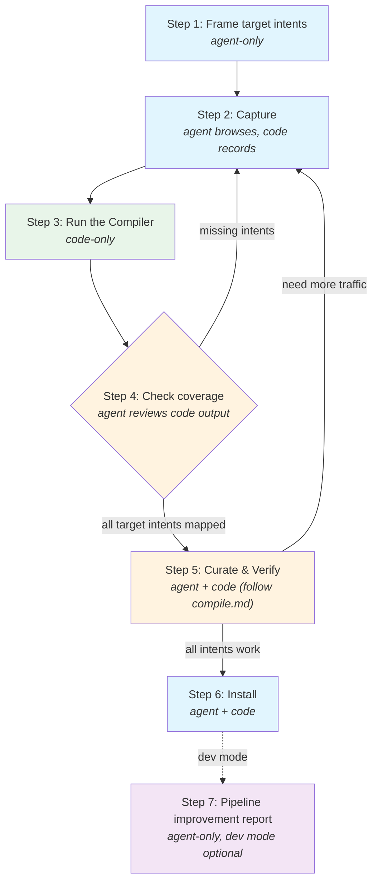

# Discovery Process

How to add a new site or expand an existing site's operation coverage.

**Responsibility:** Full journey — from target intents to working operations.
Coverage (are target intents in the traffic?) AND correctness (do ops return
real data at runtime?). `compile.md` is the reference guide for spec curation
and troubleshooting — used in Step 5 below.

## When to Use

- User asks about a site with no site package
- Expanding coverage for an existing site (more operations, new protocols)
- Site package is stale or has auth/transport issues

## Before You Start

Read these knowledge files in order — but scale depth to context:

- **Existing site (rediscovery/update):** Read the site's prior-round `DOC.md`
  and `openapi.yaml` from the first available source:
  1. `src/sites/<site>/` (worktree)
  2. `~/.openweb/sites/<site>/` (compile cache)
  3. `git show HEAD:src/sites/<site>/DOC.md` (if files deleted from worktree)
  Focus on: auth config, write endpoint paths, adapter/transport requirements,
  known issues (signing, SSR-only endpoints). Skim the archetype row for anything
  the DOC.md missed. Skip bot-detection unless you hit blocks.
- **Net-new site:** Read all three files below. Each produces a concrete decision
  that shapes your capture strategy.

1. **`references/knowledge/archetypes/index.md`** -- identify the archetype row.
   Then read the linked profile (e.g., `social.md`, `commerce.md`).
   **Decision:** What operations should I target? What auth and transport to expect?
   Archetypes are heuristic starting points -- define targets based on user needs,
   not copied from archetype templates.

2. **`references/knowledge/bot-detection-patterns.md`** -- check the "Detection Systems"
   section for the site (or similar sites in the same vertical).
   **Decision:** Do I need a real Chrome profile (Akamai/PX/DataDome) or will any
   browser work? Should I keep capture sessions short?

3. **`references/knowledge/auth-patterns.md`** -- scan the "Routing Table" at the top.
   **Decision:** Should I log in before capture?
   - Chinese web sites: usually `cookie_session` with custom signing
   - Google properties: `sapisidhash`
   - Reddit-like SPAs: `exchange_chain`
   - Public APIs: likely no auth needed
   If you expect auth, log in first -- unauthenticated capture misses auth-required
   endpoints entirely, wasting the capture session.

   **Auth types that CANNOT be auto-detected:**
   - `page_global` -- API keys embedded in page JavaScript (e.g., YouTube
     INNERTUBE_API_KEY). Must be manually identified by inspecting page source
     for global variable assignments containing API keys.
   - `webpack_module_walk` -- tokens stored in webpack module closures (e.g.,
     Discord). Must be manually specified. The runtime supports it; the
     compiler cannot discover it.

   If the existing package uses these auth types, PRESERVE them during merge
   (see compile.md "Merging with an Existing Package").

## Critical Rule: Browser First, No Direct HTTP

**NEVER use curl, fetch, wget, or any direct HTTP request to probe a site.**
Not even to "check if it works" or "see what the response looks like."

Bot detection systems track IP reputation across all requests. A single curl request
registers as non-browser traffic and raises the IP's risk score. Multiple probes
escalate to an IP-level block that poisons subsequent browser sessions too.

**Always use the managed browser.** If the browser hits a CAPTCHA, that is the time
to decide whether to solve it or declare the site blocked.

## Write Operation Safety

When discovering write operations (POST/PUT/PATCH/DELETE), capture the traffic but
be cautious. Mark each write in DOC.md with a safety level.

| Level | Examples | Rule |
|-------|----------|------|
| SAFE | like, bookmark, follow, add-to-cart | Capture freely, reversible |
| CAUTION | send message (to self), post (then delete) | Only in safe contexts |
| NEVER | purchase, delete account, send to others | Do not trigger during discovery |

Verify skips write operations by default (internally `replaySafety: unsafe_mutation`).

## Process



**Legend:** blue = agent-driven | green = code-only | orange = agent reviews code output | purple = dev mode optional

### Step 1: Frame the Target

Define 3-5 target intents as **user actions**, not API names.

- If the user asked for specific operations, those are your targets.
- Otherwise, derive from the archetype profile and user needs.
- Create or update `src/sites/<site>/DOC.md` with an initial overview and a
  target-intent checklist (following `references/site-doc.md`).

**Good target intents:**
- E-commerce: "search products by keyword", "get product detail page", "get reviews for a product"
- Social: "search posts by keyword", "get post with comments", "get user profile"
- Travel: "search flights by route and date", "get pricing details"

#### Write Operation Discovery

After framing read intents, add write intents for the site's core interactions:

| Archetype | Typical write intents |
|-----------|----------------------|
| Social | like/upvote, follow/unfollow, bookmark/save, repost/share |
| E-commerce | add to cart, add to wishlist |
| Messaging | send message (to self/test channel only) |
| Content | post content (then delete), comment |

These use the same capture flow -- perform the action in the browser during
Step 2. The safety table above applies. Perform ALL safe write actions during
capture: like, follow, bookmark, repost/share. Each triggers a different API
endpoint. Missing a write action means missing that operation entirely — write
endpoints cannot be inferred from read traffic.

### Step 2: Capture

```bash
openweb browser start
openweb capture start --cdp-endpoint http://localhost:9222
```

Browse the site systematically in the managed browser to trigger each target intent:
- Do a search (triggers search API)
- Click into a result (triggers detail API)
- Scroll or paginate (triggers pagination)
- Check other features (reviews, profile, settings)

Browsing tips:
- **Vary your inputs** -- use 2-3 different search terms to give the analyzer
  multiple samples per operation (helps schema inference and path normalization).
- **Wait for content to load** before navigating away -- some sites lazy-load.
- **Click through UI tabs** on profiles and feeds — each tab triggers a different
  API endpoint. Profile sub-tabs (Answers / Articles / Favorites), feed tabs
  (Following / Hot / Latest), sort tabs (Hot / New / Top). Hit the top 2-3 tabs.
- **Search: use the on-page search box**, not URL navigation. `page.goto()` to
  a search URL delivers SSR HTML; typing in the SPA search widget triggers the
  JSON API endpoint.
- **If the site requires login**, log in in the managed browser. For net-new
  sites, `openweb login <site>` won't work — authenticate via the target URL
  directly. Existing Chrome profile logins may carry over.
- **Trigger write actions** after browsing read flows: like a post, follow a user,
  bookmark content. These generate write operation traffic. See the Write Operation
  Safety table above for which actions are safe to capture.

  **Executing write actions programmatically:**

  *Approach 1 — Click UI buttons* (when selectors are findable):
  Navigate to a content detail page. Find the button using common selectors
  (`[class*="like"]`, `[aria-label*="like"]`, `[data-action="like"]`), scroll it
  into view, click, wait 2s for the POST to fire. If `.click()` doesn't trigger
  the API call, try `dispatchEvent(new MouseEvent('click', {bubbles: true}))`.

  *Approach 2 — Call write APIs directly* (preferred — see Direct API Calls below):
  Use `page.evaluate(fetch('/api/endpoint', {method:'POST', credentials:'same-origin'}))`.
  Read the CSRF token from `document.cookie` if the site uses CSRF. Find write
  endpoint paths in the site's prior-round DOC.md or openapi.yaml — write
  endpoints cannot be discovered from read traffic alone.

  After each write action, trigger the reverse to capture both sides (like/unlike,
  follow/unfollow, bookmark/unbookmark).
- **If you expect auth-required operations:** Log in FIRST, then capture.
  Auth detection requires seeing auth tokens in the traffic. Specifically:
  - **exchange_chain (Reddit-like):** Do a COLD page load (clear cookies or
    incognito) so the token exchange request appears in the HAR.
  - **sapisidhash (Google/YouTube):** Must be logged into a Google account.
    SAPISID cookie and `SAPISIDHASH` Authorization headers must appear in HAR.
  - **cookie_session with CSRF:** Perform at least one mutation (like, follow)
    so the CSRF token appears in POST request headers.
- **Avoid** logout, delete account, billing, irreversible actions.

**SPA navigation rule:** Use **in-app navigation** (click links in the UI), not
address-bar navigation or `window.location.href`. Full-page reloads deliver data
via SSR — JSON API calls only fire during SPA client-side routing. For
programmatic browsing: `element.click()` on links, not `Page.navigate`.

#### Direct API Calls via page.evaluate(fetch)

Calling APIs directly from the page context is often the most reliable capture
method — more reliable than hoping UI clicks trigger the right requests:

```javascript
await page.evaluate(() => fetch('/api/endpoint?param=value', {
  credentials: 'same-origin'
}));
```

**When to prefer direct fetch over SPA navigation:**
- POST-based APIs (Innertube, GraphQL) — clicks may not send the right body
- You know the API pattern but can't find the UI button
- You want multiple samples with varied parameters for better schema inference
- REST endpoints are more stable than GraphQL `doc_id` hashes

**Combine with UI browsing:** Direct calls fill known coverage gaps; UI browsing
discovers endpoints you don't know about. Use both in each capture session.

**Same-origin only.** `page.evaluate(fetch(...))` is blocked by CORS for
cross-origin URLs. Navigate to the target subdomain first, then use relative paths.

#### Capture Target Binding

Capture is **browser-wide**, not single-tab. On start, it attaches HAR + WS
recording to `pages()[0]`, then auto-attaches to every new tab opened
afterwards via `context.on('page')`. Pre-existing tabs (opened before capture
started) are NOT monitored, except `pages()[0]`.

What this means in practice:
1. **Start capture FIRST**, then open new tabs — they auto-attach.
2. **Pre-existing tabs are blind spots.** If you opened tabs before capture,
   their traffic won't appear in the HAR.
3. **`page.evaluate(fetch(...))` works** on any monitored page — the initial
   page or any tab opened after capture started.
4. **Separate Playwright connections don't work.** A `page.evaluate(fetch())`
   on a Page from a different Playwright `connect()` call uses a Page object
   that capture doesn't monitor. Use CDP on the existing browser context, or
   navigate in a tab that capture already tracks.

**Verification:** After capture, check `summary.byCategory.api`. If it's 0
despite browsing, traffic likely came from a pre-existing tab or a separate
Playwright connection.

```bash
openweb capture stop
```

The capture directory (default `./capture/`) now contains `traffic.har`,
`state_snapshots/`, and optionally `websocket_frames.jsonl`.

#### Capture Troubleshooting

| Symptom | Cause | Fix |
|---------|-------|-----|
| HAR has 0 API entries for target site | Browsing happened in a pre-existing tab (opened before capture) | Start capture first, then open a NEW tab for the site |
| `page.evaluate(fetch())` not in HAR | Fetch ran on a Page from a separate Playwright connection | Use CDP on the capture's browser context, or navigate a monitored tab |
| `No active capture session` on stop | Stale PID file or process killed | `pkill -f "capture start"`, delete PID file, restart |
| HAR empty / truncated | Process killed before flush | Stop with `openweb capture stop`, never `kill -9` |
| Another worker's stop kills your data | Global capture stop | Use Playwright `context.recordHar()` for isolated capture |

### Step 3: Run the Compiler

Run the compile command on the captured traffic:

```bash
openweb compile <site-url> --capture-dir <capture-dir>
```

**Important:** This runs the FULL pipeline in one shot -- analyze, auto-curate,
generate, and verify. It produces:

| Output | Location | Purpose |
|--------|----------|---------|
| `analysis.json` | `~/.openweb/compile/<site>/` | Analysis report (response bodies stripped) |
| `analysis-full.json` | `~/.openweb/compile/<site>/` | Full report (large, rarely needed) |
| `verify-report.json` | `~/.openweb/compile/<site>/` | Per-operation verification results |
| `summary.txt` | `~/.openweb/compile/<site>/` | One-line summary |
| `openapi.yaml` | `~/.openweb/sites/<site>/` | Generated HTTP spec |
| `asyncapi.yaml` | `~/.openweb/sites/<site>/` | Generated WS spec (if WS traffic) |
| `manifest.json` | `~/.openweb/sites/<site>/` | Package metadata |
| `examples/*.example.json` | `~/.openweb/sites/<site>/` | Example fixtures (PII-scrubbed) |

The auto-curation accepts all clusters, picks the top-ranked auth candidate,
and uses the analyzer's suggested operation names (camelCase by default, e.g.,
`listUsers`, `getProduct`). Step 5 is where you review and fix these — see
`compile.md`.

### Step 4: Check Coverage

Read the analysis report to verify your target intents are represented.

**DO NOT read the entire `analysis.json`.** It can be very large (the `samples`
array alone may contain thousands of entries). Read specific sections only.

#### analysis.json structure (top-level fields)

```
{
  "version": 2,
  "site": "...",
  "sourceUrl": "...",
  "generatedAt": "...",
  "summary": { ... },          // ~10 lines - READ THIS FIRST
  "navigation": [ ... ],       // page-level request groups - skip for coverage check
  "samples": [ ... ],          // HUGE - every labeled request - DO NOT READ
  "clusters": [ ... ],         // ~20-100 lines per cluster - READ FOR COVERAGE
  "authCandidates": [ ... ],   // ~10-30 lines - GLANCE for compile handoff
  "extractionSignals": [ ... ],// ~5-20 lines - READ if SSR suspected
  "ws": { ... }                // optional WS analysis - READ if WS expected
}
```

#### 4a. Read the summary

Use offset/limit to read just the first ~30 lines (covers `version` through `summary`):

- `summary.byCategory.api` -- how many requests were labeled as API calls?
  If zero or very low, the capture missed target traffic. Return to Step 2.
- `summary.byCategory.off_domain` -- if high, your API may live on a different
  domain (e.g., `chatgpt.com` calls `api.openai.com`). Re-compile using the
  API domain as the site URL instead.
- `summary.clusterCount` -- how many candidate operations were found?

#### 4b. Read the clusters

Search for `"clusters"` in the file, then read that array. For each cluster:
- `suggestedOperationId` and `suggestedSummary` -- what operation was detected?
- `method` and `pathTemplate` -- the HTTP shape
- `sampleCount` -- how many requests matched this cluster
- `graphql` -- present if this is a GraphQL sub-cluster. Check `operationName`
  and `discriminator` (tells you how sub-clusters were split).

**Map each target intent to a cluster.** If a target intent has no matching
cluster, it was not captured (return to Step 2 for more browsing).

**Watch for GraphQL collapse:** A cluster with high `sampleCount` (100+) on a
single path like `/graphql` with NO `graphql` sub-cluster metadata means all
GraphQL operations collapsed into one cluster. The analyzer failed to
sub-cluster them. This happens when the capture lacks varied `operationName`
or `queryId` values. Fix: return to Step 2 and interact with more diverse
features in the UI.

#### 4c. Check auth candidates (brief)

Note the `authCandidates` top candidate's `auth.type` and `confidence`. You will
confirm or override this during compile review — see compile.md Step 2a for
detailed auth analysis.

If `authCandidates` is empty or has only `confidence: 0` entries, no auth was
detected. Expected for public APIs; a red flag for sites that require login.

#### 4d. Check extraction signals (brief)

Note whether `extractionSignals` contains entries (`ssr_next_data`, `script_json`).
If your target intent's data is in SSR HTML rather than API calls, this confirms it.

For detailed extraction analysis, see compile.md Step 2c.

#### 4e. When to stop

> **When to stop iterating:**
> - After 2 capture iterations with no new clusters for a target intent, the
>   intent may be infeasible with the current pipeline.
> - If the site is flagged as BLOCKED in the archetype profile, stop immediately
>   and tell the user.
> - If bot detection blocks all transports (node returns 403, page returns
>   challenge pages), document the blocker in DOC.md Known Issues and tell
>   the user which intents could not be fulfilled.

#### 4f. Fill gaps (if coverage is incomplete)

If target operations are missing from the analysis:

- **No API calls for a feature?** Check if data comes from SSR. In the browser,
  view page source or use `page.evaluate(() => document.querySelector('#__NEXT_DATA__')?.textContent)`
  to check for embedded JSON.
- **API calls on a different domain?** Check `summary.byCategory.off_domain`.
  Re-compile with the API domain as the site URL.
- **Login required?** Open the target URL in the managed browser, log in there,
  then re-capture with authenticated browsing. For net-new sites, do not use
  `openweb login <site>` -- that command requires an existing site package.
- **GraphQL single endpoint?** Try different queries in the UI -- the analyzer
  needs varied `operationName` or `queryId` values to sub-cluster correctly.
- **Lazy loading?** Scroll down, click "load more", wait for content to appear.

Repeat Steps 2-5 until every target intent returns real data via `exec`.

### Step 5: Curate & Verify (follow compile.md)

Review and curate the compiled package until target intents work at runtime.

**You already compiled in Step 3.** This step uses compile.md as a
review/curation reference, not a second compile run.

**Follow `compile.md` for this entire step.** It covers:
- How to read analysis.json (auth candidates, CSRF options, clusters)
- How to curate the spec (fix auth/CSRF, rename ops, exclude noise, set transport)
- How to verify (runtime exec, not just verify-report.json)
- How to diagnose and fix failures (decision table by HTTP status)
- When to re-compile with `--curation`

**Exit criterion:** For each target intent, at least one operation returns
real data via `openweb <site> exec <op> '{...}'`.

If compile.md's verify loop determines you need more traffic (missing endpoints,
wrong API domain), return to Step 2 (Capture).

### Step 6: Install

Follow **compile.md Step 5 (Install the Site Package)** for the full install
process: copy spec files, merge with existing package, write DOC.md per
`references/site-doc.md`, write PROGRESS.md, build and test, update knowledge.

Then continue to Step 7.

### Step 7 (dev mode, optional): Pipeline Improvement Report

If you hit friction during Step 5 that wasn't site-specific — a rule too
tight, a heuristic too loose, a doc gap that wasted a cycle — write it up.

Create `src/sites/<site>/pipeline-gaps.md`. The goal is NOT to overfit to this
site, but to surface systematic issues that make ALL site discoveries less
efficient.

**What to cover:**

| Category | What to write |
|----------|--------------|
| **Doc gaps** | Missing guidance in discover.md or compile.md that caused you to waste a cycle. What should the doc have told you? |
| **Code gaps** | Pipeline heuristics that produced wrong results (e.g., CSRF auto-detection picked wrong cookie, transport always defaults to node). Include file:line references. |
| **Rules too tight** | Filters or gates that rejected valid data (e.g., httpOnly cookies excluded from CSRF candidates, off-domain APIs silently dropped). |
| **Rules too loose** | Heuristics that let noise through (e.g., tracking cookies scored as auth, client hint headers matched as CSRF). |
| **Missing automation** | Manual steps that should be automated (e.g., no bot-detection signal → transport recommendation, no target-intent filtering during auto-curation). |

**Format:** For each issue, write: **Problem** (what happened), **Root cause**
(file:line if code), **Suggested fix** (what would help all sites, not just this one).
Only upstream improvements — skip site-specific workarounds already resolved in Step 5.

## Incremental Discovery (Existing Sites)

Follow the "Before You Start" fast-path (reads existing DOC.md + openapi.yaml),
identify gaps, then enter at Step 2 for targeted capture. Continue through
Steps 3-6, updating DOC.md and PROGRESS.md at install.

## Multi-Worker Browser Sharing

Multiple workers can share one Chrome browser on the same CDP port:
1. **ONE worker starts capture** — it's browser-wide, not per-tab.
2. **Each worker opens a NEW tab** after capture starts (auto-attached via
   `context.on('page')`). Do NOT close or navigate other workers' tabs.
3. **Workers browse in their own tabs.** All tabs' traffic merges into one
   HAR. The compile command filters by site URL.
4. **Last worker to finish** triggers `capture stop`.
5. For **same-site parallel capture**, use separate browser instances on different
   CDP ports, or capture sequentially.
6. If `capture start` is already running (another worker started it), skip it —
   your new tabs are auto-attached and traffic is already being recorded.

## Related References

- `references/compile.md` -- spec curation, auth troubleshooting, transport selection (self-contained reference)
- `references/site-doc.md` -- DOC.md / PROGRESS.md template
- `references/update-knowledge.md` -- when to write cross-site patterns
- `references/knowledge/archetypes/index.md` -- site type expectations
- `references/knowledge/auth-patterns.md` -- auth primitive detection
- `references/knowledge/bot-detection-patterns.md` -- anti-bot measures
- `references/knowledge/troubleshooting-patterns.md` -- failure diagnosis patterns
